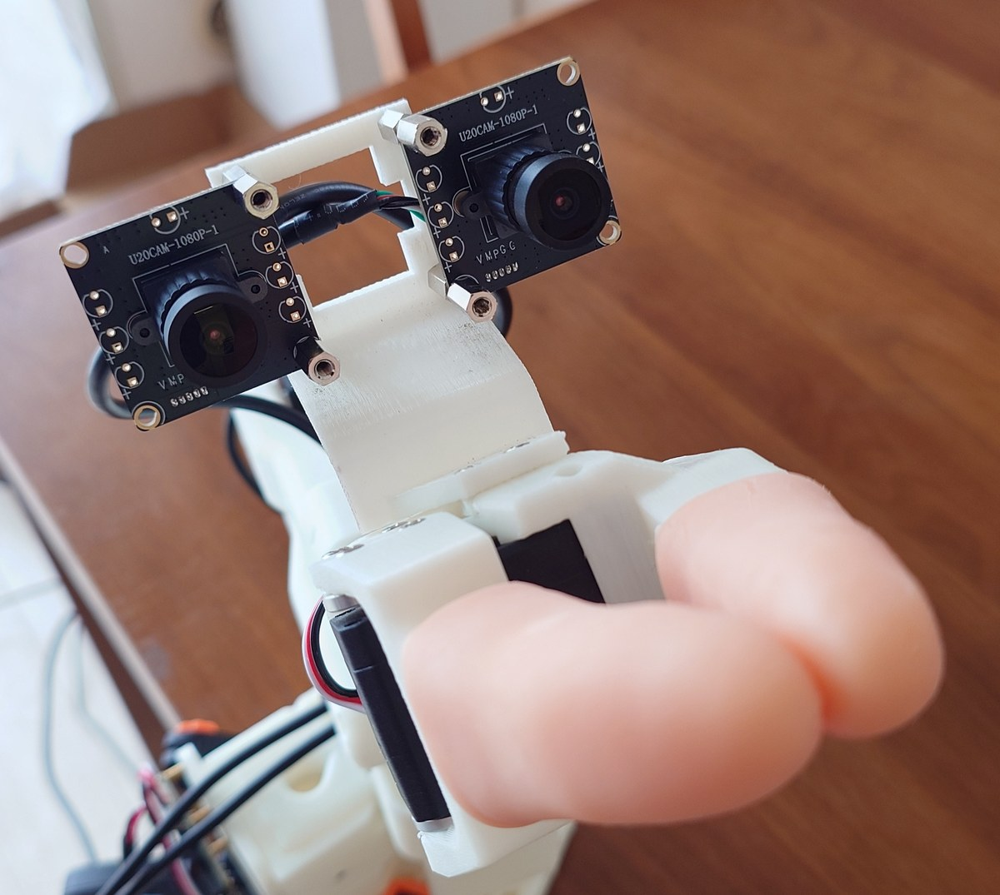

# ものごころ/MONOGOKORO, Thinks of Things, 物心

**日本語** | [English](README_EN.md) | [简体中文](README_CN.md)

このリポジトリは、LeRobot-ACT-SO-101 スタックに「運動神経」を実装する。

日常語のほうの運動神経 — つまり脊髄反射と小脳のことであって、解剖学のそれ（α運動ニューロン）では
ない。そちらは STS3215 の中にあり、ホストから書けるトルクレジスタがない以上、このフォークが最後まで
触れられなかった唯一の層である。

[LeRobot](https://github.com/huggingface/lerobot) のフォークで、SO-101 にポリシーの*下*に位置する
運動層のうち 2 つを与える。ひとつは接触を押し切らずに関節とグリッパが受け流す**脊髄反射**、もうひとつは
反射が負荷を感じる前にそれを打ち消すことをオンラインで学習する**小脳**。ACT はその結果生じる力を
見て、どれだけ強く抗うかを指令する。3 つ目の層はその両方より下にあり、そもそもソフトウェアではない —
柔らかい指先で、ここにあるどのループよりも速く接触に答える。

アップストリームの [`d36d404b`](https://github.com/huggingface/lerobot/commit/d36d404b)
(2026-08-31, 0.6.2 系列) まで同期済み。アップストリームの機能はすべてそのまま動く — 本フォークが
足すのはロボット 1 種、リアルタイム制御器、オンライン学習するフィードフォワード層、そして ACT が
推論する対象の 2 次元ぶんの拡張だけである。ポリシーのアーキテクチャには一切手を入れていない。

## なぜ

「フィジカル AI」と呼ばれているものは、そのほとんどが大脳の話である。実際に物理へ触れる層 —
接触にリアルタイムで応答する部分 — は空いたままだった。

目的は、ポリシーより下の層を、誰でも買えるハードウェアと誰でも読めるソフトウェアだけで作ることに
ある。ラボの実験装置ではない。3D プリントしたアーム、ホビー用サーボ、ノート PC、メインラインの
カーネル、そしてもとから載っていた統合 GPU。

素の SO-101 の制御は `Goal_Position` を書き込み、サーボ内蔵の PID にそこまで駆動させる。この制御器に
接触という概念はない。物体に阻まれても、決して届かない位置へ向けて出力を上げ続ける。ポテトチップスは
アームがそれを感じたと言えるより先に割れる。しかもポリシーの側には、*しっかり押す*と*そっと支える*を
区別する語彙がない — 言えることは `Goal_Position` だけだ。

生物はこれを脳で解いてはいない。伸張反射は脊髄内で閉じたバネ・ダンパであり、下行性の指令が指定するのは
力ではない。指定するのは平衡位置と、ガンマ運動ニューロンを介したその反射の*ゲイン*である。

反射だけでは足りず、その不足分はきっちり計算できる。反射はすでに起きた誤差にしか答えられないので、
定常負荷を担う関節は目標より `holding_duty / K` だけ下にずっと居座る。フィードバック則がこの垂れ下がりを
縮める唯一の方法は `K` を上げること — つまり、そもそも与えるはずだったコンプライアンスを返上することだ。
誤差が現れる*前*に負荷を打ち消すのは別の仕事であり、生物はそれを別の構造に割り当てている。

というわけでここには 4 つの層があり、それぞれが今いる場所にいる理由がある。

|                                  | 生物               | ここでの実装                                | レート   |
| -------------------------------- | ------------------ | ------------------------------------------- | -------- |
| ループを介さずに接触へ答える     | 前反射: 筋と組織   | 各指のシリコン指サック 3 層                 | —        |
| 脳を介さない高速なローカルループ | 伸張反射           | Rust デーモン、`SCHED_FIFO`、隔離コア       | 400 Hz   |
| 自分の誤差から学ぶ予測           | 小脳               | iGPU 上の Vulkan コンピュート、専用スレッド | 200 Hz   |
| 知覚を通る低速ループ             | 視覚フィードバック | ACT                                         | 約 30 Hz |

反射と ACT のあいだの約 13 倍という隔たりは、おおむね生物が回している比率であり、制御則が Python に
住んでいない理由でもある。小脳はその中間に位置し、名前のとおり反射弓の*外側*にいる — ループの中に
一度も入らないままループを補正する。

橋核はこの表に行を持たない。層ではなく**経路**だからだ — 一番上から小脳の苔状線維へ文脈を下ろす
だけで、それ自体はループを閉じず、したがって自分のレートも持たない。何を下ろして何を下ろさないかは
[5 節](README_DETAIL.md#5-何を持っているかを小脳に伝える橋核)にある。

一番上の行はこのリポジトリで最も安く、そしておそらく最も効いている。接触の過渡はこの表のどのループ
よりも速い — 指先が物に触れた瞬間の力の立ち上がりは反射の 2.5 ms のティックの内側で終わるので、それに
*最初に*答えるものは制御器ではありえない。生物の答えは**前反射 (preflex)** である: 筋と組織が持つ
固有の機械的応答で、反射弓を一度も通らずに遅延ゼロで返る。ここではそれが各指に重ねたシリコン指サック
（あかぎれ用の肉厚 2 mm のもの。手元のは Rimikuru の指サポーター。紙を数える事務用の薄いものではない）であり、
軟らかい指を持つ動物が壊れやすい物を雑に扱えて、このアームにそれができない理由でもある。

<p align="center">
  
</p>

それはグリッパの触覚を細かくもする。こちらは少し分かりにくい。握力はもともと読めていた — 接触後は
指令位置だけが進んで実位置は止まるので、`pwm = K * err` が握りの強さを追う。柔らかい指先が変えるのは
その*目盛り*である。同じ力の範囲がはるかに多くのエンコーダカウントに広がる — ロードセルに起歪体が
あるのは、まさに力を測れるだけの変位に変えるためだ。信号は初めからそこにあり、パッドはそれに細かい
物差しを与えた。このアームでそれがどれだけかはまだ測っていない — そして効果を丸ごと食い潰しうる候補が、
既知の制限にある静摩擦である。

この 4 つの層に新しいアイデアは一つも無い。インピーダンス制御は Hogan, 1985。顆粒層で拡張して線形に
読み出し登上線維で教える構成は Marr・Albus・Ito であり、Albus は 1975 年にそれで制御器を作っている。
センサの手前にコンプライアンスを直列に入れて、力を測れるだけの変位に変えるのは、1995 年以来の直列
弾性アクチュエータそのものである。位置誤差で駆動する双方向テレオペレーションは、そのどれよりも古い。

新しいのは、それらが動く場所のほうだ。どれも当時は個人が買えないハードに付随していた — トルク制御
可能なアーム、速いループを閉じるための dSPACE や DSP ボード、学習を回すためのそれなりの計算機。
その 4 つが今はノート PC 1 台に収まる。適応層は最初から入っていた統合 GPU の上で回り、リアルタイム
ループは素のカーネルの上で回る — PREEMPT_RT が upstream に入ったのは 2024 年で、これが当たり前に
なってからまだ 2 年ほどしか経っていない。

したがってここでの貢献は機構ではない。移植であり、それに付いてくる数値である: Marr-Albus 層が
Arc 140V で実際にいくらかかるのか、なぜ制御ティックの内側に置けないのか、ホビーサーボのバスが
400 Hz で何をするのか。どれも調べれば載っているものではなかった。下の実測の節があれだけ長いのは
そのためである。

## このフォークが追加するもの

```
   operator's hand                                                        camera
        │  ▲                                                                 │
   ┌────┴──┴────┐                                                            │
   │ SO-101     │  gripper: force feedback ──┐                               │
   │ leader     │  5 joints: backdriven      │                               ▼
   └────────────┘                            │                    ┌──────────────────┐
        │ pos                                │                    │ ACT              │
        ▼                                    │                    │                  │
   ╔═══════════════════════════════════════╗ │                    │ in:  images      │
   ║ Rust RT daemon  ·  400 Hz             ║◄┘   shared memory    │      pos    ×6   │
   ║ SCHED_FIFO, isolated core             ║◄──── seqlock ───────►│      current×6   │
   ║  pwm = K·Δx + D·Δv + ff   (6 motors)  ║                      │                  │
   ║  owns both serial buses               ║                      │ out: pos ×6 ┐    │
   ╚═══════════════════════════════════════╝                      │      K   ×6 ├ ×N │
     │ PWM   ▲ pos, current    │ state  ▲ ff                      │      D   ×6 ┘    │
     ▼       │                 ▼        │                         └──────────────────┘
   ┌───────────┐          ╔═════════════════════════╗
   │ SO-101    │          ║ cerebellum · 200 Hz     ║
   │ follower  │          ║ Vulkan on the Intel iGPU║
   │ 6×STS3215 │          ║ 16384 granule → 6 PC    ║
   └───────────┘          ║ three-factor Hebbian    ║
                          ╚═════════════════════════╝
```

**各層の詳細は [README_DETAIL.md](README_DETAIL.md) にある** — 実装、根拠、そして何が効かなかったか。

## クイックスタート

```bash
# 1. ビルドして、必要な特権 capability を 1 つだけ付与する。setcap は再ビルドのたびに失われる。
cd rust/so101_impedance_ctrl && cargo build --release
sudo setcap cap_sys_nice+ep ./target/release/so101_impedance_ctrl

# 2. デーモンを起動する。Python がアタッチする前に動いている必要がある。
#    RUST_LOG=info を外すと起動ログが一切出ない。小脳の backend や supply の初回読みは
#    そこにしか出ないので、確認するつもりなら必須。
RUST_LOG=info ./target/release/so101_impedance_ctrl \
  --port /dev/ttyACM0 --shm-name so101_impedance --cpu-core 3 --priority 99

# 3. テレメトリを確認する。アームはトルクオフで、手で動かして安全な状態になっている。
python examples/check_so101_impedance.py --shm-name so101_impedance
```

あとは `--robot.type=so101_follower_impedance` で遠隔操作なり記録なりを行う。どちらもロボットの設定から
関節ごとの K/D を自動で埋める。

小脳はオプトイン。手順 2 に以下を足す (ビルドに `glslc`、実行に Vulkan ICD、そして **`--cpu-core` とは
別の**ハウスキーピング用コアが必要)。

```bash
  --cerebellum-backend gpu --cerebellum-cpu-core 1 \
  --cerebellum-weights ~/.local/share/so101/cerebellum.bin
```

- 隔離コアのセットアップ: [`rust/so101_impedance_ctrl/PREEMPT_RT.md`](rust/so101_impedance_ctrl/PREEMPT_RT.md)
- ゲイン調整、小脳の立ち上げ、プロトコルの注意点: [`rust/so101_impedance_ctrl/README.md`](rust/so101_impedance_ctrl/README.md)
- LeRobot 一般の使い方 (記録、学習、評価): [`AGENT_GUIDE.md`](AGENT_GUIDE.md)

## 実測値であって仮定ではない

開発機は ThinkPad X1 Carbon Gen 13 — Core Ultra 7 258V (Lunar Lake)、iGPU は Arc 140V。ここに挙げた
数値のいくつかは、ドキュメント上の値や直感的な値が間違っていると判明した後、この実機で決着をつけた
ものだ。この機材に固有の値であり、別の環境では測り直す価値がある。

| 対象                      | 値                                              | どう決着したか                                                                                                                                                                                    |
| ------------------------- | ----------------------------------------------- | ------------------------------------------------------------------------------------------------------------------------------------------------------------------------------------------------- |
| PWM の符号ビット          | **10**                                          | ビット 11 (アップストリームの docstring どおり) では関節は反転しない — 追加の大きさとして消費される                                                                                               |
| `--invert-pwm`            | **true**                                        | 正しい符号ビットを使ってもなお、正のデューティでエンコーダ値が下がる                                                                                                                              |
| 関節ごとの K              | 10/20/15/10/8/5                                 | K=1 で保持させると、報告される PWM が各関節の重力+摩擦ぶんのデューティとして読める                                                                                                                |
| 関節ごとの D              | 約 K/40                                         | 上限を与えているのは安定性ではなく、速度の量子化ノイズフロア                                                                                                                                      |
| 手首ステレオの基線        | **55 mm**                                       | 視差からの推定は 57.8 mm、定規で 55 mm。差の 5% は視差に乗った回転由来の定数オフセット (+39 px) で、垂直方向に独立に測った +42 px と一致する                                                      |
| 収録解像度                | **640x360**                                     | このカメラの 4:3 モードは縦が増えるのではなく横が 25% 削られる。640x480 ではステレオの重なりが 58% → 43% に落ち、画素は 640x360 より 25% 多い。ACT はリサイズしないので画素数はそのまま学習コスト |
| iGPU のコンピュートキュー | **1**                                           | キューファミリ 1、キュー 1、しかもグラフィックスと共用 — コンピュートのサブミットをコンポジタを避けてスケジュールすることはできず、CPU の隔離では何も変わらない                                   |
| 小脳 1 ステップ           | アイドル時 平均 307 µs、**負荷時 最大 2969 µs** | 1 ステップが 2.5 ms の制御周期まるごとを超えうる。最大値は層のサイズを変えてもほとんど動かないので、計算ではなくサブミットのジッタである                                                          |
| ACT 1 回の forward        | **30 ms** (bf16)、44 ms (fp32)                  | iGPU、2 カメラ 480x640。1 カメラなら 16 ms なので視覚が支配的。`n_action_steps` の既定が 100 なので 30 Hz のロボットは 3.3 秒に 1 回 — 占有率 0.9%。`examples/load_igpu_with_act.py`              |

A/B 測定の全文は [README_DETAIL.md](README_DETAIL.md) にある。

<p align="center">
  
</p>

上の表の手首ステレオの 2 行は、この写真で読める。レンズが広角なのは見れば分かる。各カメラ基板が
対角 2 本のスペーサだけで留まっているのも見れば分かり — 後者が、視差に乗った定数オフセットの
出どころとして一番ありそうなものだ。レジスタもマッチングも、そこまでは言わなかった。

## 既知の制限

- **橋核の文脈チャネルは実機で未検証で、それを _推論_ するものはまだ無い。** 配線は端から端まで
  通っている — config から共有メモリ、苔状線維まで。実演時の文脈もアクション列として記録される。
  ただし 2 つの定数は実アームではなく CPU リファレンスに対して測ったものであり、ポリシーは画像から
  予測することを学ぶまで、操作者がラベルした値をそのまま再現するだけである。
- **小脳の垂れ下がりは 2026-09-08 に取り直した。2026-08-28 の数値は撤回する。** 旧セッションは K を
  変えないまま `shoulder_pan` 3.00 → 0.00、`elbow_flex` 9.00 → 0.00、`shoulder_lift` 12.57 → 3.00
  カウントの垂れ下がりを報告したが、当てにしないこと。`shoulder_pan` のパワーステージがショートして
  いて、書き込むたびに共有レールが 4.6 V から 2.4 V へ約 820 ms 落ちていた。このページは以前「両側が
  同じ故障の下で走ったから*比較*は生き残る」と書いていたが、これは誤りだった。故障はセッション途中で
  始まっており、各ランがどちら側で走ったかで効果の向きが変わる。CSV も失われている。
  **取り直した値**（レール平均 4.52 V・最小 4.50 V、同一 pose ファイル、K 据え置き、手首にステレオ
  カメラ 2 枚を載せた状態）: 垂れ下がりは `shoulder_lift` 5.00 → 1.02、`elbow_flex` 21.00 → 1.00
  カウント。~~ベースラインは `err = pwm / K` が小数点まで一致した（100/20、315/15、標準偏差 0.00）。
  保持デューティの計器は小脳オフの垂れ下がりである~~ — **この 2 文は 2026-09-09 に撤回した。**
  `err = pwm / K` は経路に PD 則しか無ければ**恒等式**で、一致は算術の帰結であって測定が正しい証拠
  ではない。標準偏差 0.00 も「静止している」としか言わず、**静止は釣り合いと固着を区別しない**。
  同じ設定で 4 本測ると `shoulder_lift` の保持デューティは 100 / 180 / 200 / 255 とばらつき、
  どれも標準偏差 0.00 だった。**保持デューティは単一の値ではなく帯を持つ。** 同じ目標に上から/下から
  近づけて測った帯の幅は `shoulder_lift` が 18.0 カウント（デューティ 360）、`elbow_flex` が
  12.9 カウント（デューティ 194）で、**帯は保持デューティ本体と同じオーダーある**。100/315 は
  帯の値ではなく、上から近づいたときの端だった（`--approach-from` で測定、2026-09-09、
  レール 4.40-4.51 V、ケース温度 26-32℃、湿度 25%）。ff の読み値が `--cerebellum-cf-deadband`
  しだいで経路依存になるのは変わらない。そして **2 関節が `--cerebellum-ff-max` に達した件は、
  水増しではなかった**: 健全なレールでも `elbow_flex` は 315 を要求し、300 のクランプに当たる。
  **正常動作で当たるクランプは、正常と異常を区別できない。** 上限は置き直しが要る（未着手 —
  315 は 1 姿勢の帯の端の値で、他の姿勢での正当な最大値は測っていない）。
- **フィードフォワードは収束せず減衰した。修正済み。ただし修正値は未実測。** どちらの学習ランでも、
  関節が完全に静止したまま数分の時定数で減衰し、やがてアームが滑るとクランプまで跳ね戻った。原因は
  アームではなく学習則にあった。減衰項が適格性トレースだけでゲートされ登上線維でゲートされていなかった
  ので、平衡が `w = cf / leak` — つまり**重みを保つのに定常誤差が要る**構造だった。それが残す残差は
  1 PWM カウント未満で摩擦帯より狭く、帯の内側では関節が動けないので誤差を報告すること自体ができない。
  現在はどちらの項も登上線維でゲートされ、`--cerebellum-cf-deadband`（既定 5.0）が「反射が黙っている」
  境界を決める。**この既定値は 2026-09-08 に健全なアームで測り、低すぎることが分かった。** 導出は
  「漏れの残差より上、1 エンコーダカウント×関節剛性より下」だったが、位置は量子化されていて誤差は
  ゼロに届かない。`wrist_flex`（K=10）の誤差は ±2 カウントを往復し、フィードバックのデューティは 20
  を下回らないので、5 の帯には決して入らない。結果、ff が 0 と 126 のあいだを**周期 69 秒**で振り
  続けた。25 に上げると振動は消える（173 秒で 0.2 カウント以内、値も真値の 4% 以内）が、誤差が帯に
  入った瞬間に ff が凍るので **ff は荷重の測定値ではなくなり、過渡でどこまで登ったかに依存する**。
  どちらに倒すかは未決。`0` を渡せば旧挙動に戻る。
  摩擦帯そのものがギヤボックスの性質なのか電源が落ちたことの副産物なのかは、取り直しでなお切り分ける。
- **触覚は「どれだけ強く」まで。「どこで」と「滑っているか」は無い。** 柔らかい指先は握力を
  エンコーダのカウントに変え、それがここでの触覚のすべてである: 指ごとに 1 つのスカラーが、反射に
  400 Hz で届く。指のどこに当たったか、そして物が滑り*始めた*ことを告げる微小振動は、どちらも
  コモディティ部品ではなく専用のセンサを要求する — そしてこのリポジトリが示そうとしているのは、
  それ無しでスタックのどこまでを組めるかである。手首のカメラは滑った*こと*なら約 30 Hz で見られるが、
  滑り始めは見られない。
- **学習できる内容は苔状線維で決まる。** 苔状線維が運ぶのは姿勢、速度、追従誤差、電流なので、重力、
  関節摩擦、固定の積載は学習できる — が、2 つの積載物のどちらがグリッパにあるかを伝えるものが何もない
  ので、それらを区別できない。カメラ由来の特徴量が明らかに欠けている束である。
- **デモンストレーションはポリシー下層のラベルを与えない。** トルクオフのリーダーは位置センサに過ぎず、
  エピソードには設定のデフォルト K/D がラベルとして付く。それで学習した ACT は、ゲインを変える術ではなく
  そのデフォルトを再現する術を学ぶ。小脳の重みも同様にファイルへ残るだけで、データセットには入らない。
  リーダーグリッパの力覚フィードバックは前半を直すための第一歩であり、デモンストレーション間の分散から
  剛性を導くのが次に来る手だろう。
- **オープンループ PWM** は真のトルク制御よりノイジーである — STS3215 にはホストからストリームできる
  トルクレジスタがないので、これは選択ではなくハードウェアの制約だ。
- **デーモンは Python のビルドに含まれない。** 独立した Cargo プロジェクトであり、手動でデプロイする。
- インピーダンスロボット向けの**対話型キャリブレーションと `setup-motors`** は未実装。どちらも素の
  `so101_follower` で同じサーボに対して実行し、較正ファイルはコピーすること — 2 つのロボット型は
  別のディレクトリに書く。

## アップストリーム

上に挙げたもの以外はすべて、他のロボット・ポリシー・データセット・スクリプトを含めて無変更の
アップストリーム LeRobot である。アップストリームのドキュメントがそのまま適用できる。

- [Documentation](https://huggingface.co/docs/lerobot) · [Hub](https://huggingface.co/lerobot) · [Discord](https://discord.gg/q8Dzzpym3f)

```bibtex
@misc{cadene2024lerobot,
    author = {Cadene, Remi and Alibert, Simon and Soare, Alexander and Gallouedec, Quentin and Zouitine, Adil and Palma, Steven and Kooijmans, Pepijn and Aractingi, Michel and Shukor, Mustafa and Aubakirova, Dana and Russi, Martino and Capuano, Francesco and Pascale, Caroline and Choghari, Jade and Moss, Jess and Wolf, Thomas},
    title = {LeRobot: State-of-the-art Machine Learning for Real-World Robotics in Pytorch},
    howpublished = "\url{https://github.com/huggingface/lerobot}",
    year = {2024}
}
```

アップストリームと同じく Apache 2.0。[LICENSE](LICENSE) を参照。
