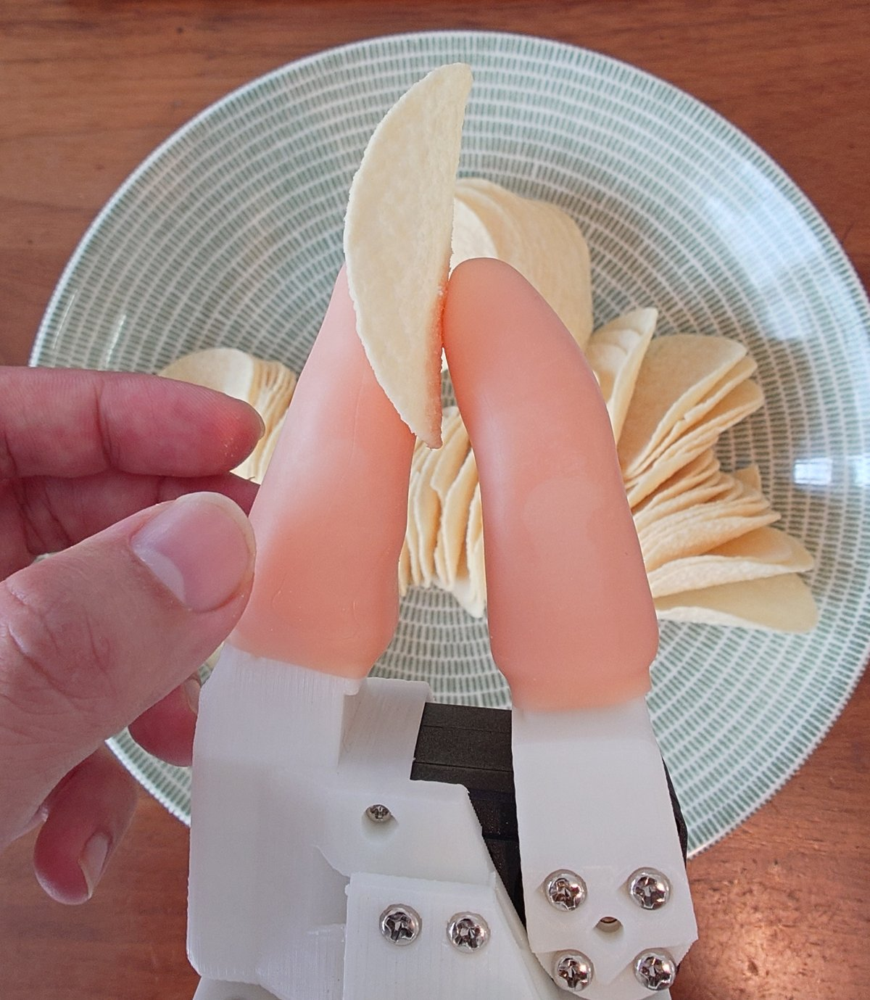

# ものごころ ≒ MONOGOKORO, Thinks of Things, 物心

[日本語](README.md) | [English](README_EN.md) | **简体中文**

本仓库为 LeRobot-ACT-SO-101 技术栈实现「运动神经」。

是日常语义上的运动神经 —— 也就是脊髓反射和小脑，而不是解剖学意义上的那个（α 运动神经元）。
后者在 STS3215 内部，而它没有主机可写的力矩寄存器，因此成了本 fork 自始至终唯一没能碰到的一层。

这是 [LeRobot](https://github.com/huggingface/lerobot) 的一个 fork，为 SO-101 补上位于策略*之下*的
两层运动层。其一是**脊髓反射**，让关节和夹爪顺着接触卸力而不是硬推过去；其二是**小脑**，它在线学习
在反射感受到负载之前就把负载抵消掉。ACT 看到由此产生的力，并指令要以多大的力度去抵抗。第三层比这
两层都更低，而且根本不是软件 —— 柔软的指尖，它对接触的应答比这里任何一个回路都快。

fork 自上游的 [`0d383d09`](https://github.com/huggingface/lerobot/commit/0d383d09)
(2026-07-24, 0.6.1 线)。上游的功能全部原样可用 —— 本 fork 只增加了一种机器人、一个实时控制器、
一层在线学习的前馈，以及 ACT 推理对象上多出的两个维度。策略的架构没有做任何改动。

## 为什么

被称作「Physical AI」的东西，绝大多数讲的都是大脑皮层的故事。真正触碰物理的那一层 ——
实时应答接触的那一层 —— 一直空着。

目标是只用谁都买得到的硬件和谁都读得懂的软件，把策略以下的层做出来。不是实验室的装置：3D 打印的
机械臂、业余级舵机、一台笔记本、一个主线内核，以及本来就装在里面的集成 GPU。

原版 SO-101 的控制是写 `Goal_Position`，让舵机内置的 PID 驱动过去。这个控制器没有「接触」这个概念。
被物体挡住时，它会朝着一个永远到不了的位置继续加大输出。薯片会在机械臂能被称作「感觉到了」之前
就碎掉。而且策略这一侧也没有区分*用力按*和*轻轻托住*的词汇 —— 它能说的只有 `Goal_Position`。

生物并不是在大脑里解决这件事的。牵张反射是一个在脊髓内闭合的弹簧-阻尼器，而下行指令指定的不是力。
它指定的是平衡位置，以及经由 γ 运动神经元设定的该反射的*增益*。

只有反射还不够，而且不足的量是可以算准的。反射只能应答已经发生了的误差，所以承担恒定负载的关节会
永远停在目标以下 `holding_duty / K` 的位置。反馈律要缩小这个下垂，唯一的办法是提高 `K` —— 也就是把
本来要提供的柔顺性交回去。在误差出现*之前*把负载抵消掉是另一件工作，生物把它交给了另一个结构。

所以这里有四层，每一层待在现在的位置都有其理由。

|                            | 生物               | 这里的实现                            | 频率     |
| -------------------------- | ------------------ | ------------------------------------- | -------- |
| 不经任何回路就应答接触     | 预反射：肌肉与组织 | 每个夹爪面上的气泡膜与指套            | —        |
| 不经大脑的快速局部回路     | 牵张反射           | Rust 守护进程、`SCHED_FIFO`、隔离核心 | 400 Hz   |
| 从自身误差中学习出来的预测 | 小脑               | 集成 GPU 上的 Vulkan 计算、独立线程   | 200 Hz   |
| 经过感知的慢速回路         | 视觉反馈           | ACT                                   | 约 30 Hz |

反射与 ACT 之间约 13 倍的间隔，大致就是生物在跑的比例，也是控制律不住在 Python 里的原因。小脑位于
两者之间，并且如其名所示位于反射弧的*外侧* —— 它从不进入回路，却修正着回路。

脑桥核在这张表里没有行，因为它不是一层，而是一条**通路** —— 它只把上下文从栈顶送下来交给小脑的苔藓
纤维，自己不闭合任何回路，因此也没有自己的频率。它送下来什么、以及刻意不送什么，见
[第 5 节](#5-告诉小脑它握着什么的脑桥核)。

最上面那一行是本仓库里最便宜的东西，也可能是最吃劲的东西。接触的瞬态比这张表里任何回路都快 ——
指尖碰到物体那一刻的力上升过程，在反射 2.5 ms 的一个 tick 内部就结束了，所以*最先*应答它的东西不可能
是控制器。生物给出的答案是**预反射 (preflex)**：肌肉与组织自身固有的机械响应，不经过反射弧、以零延迟
返回。在这里它就是气泡膜和指套，也正是有柔软手指的动物能粗手粗脚地对待易碎物、而这条机械臂不能的原因。

<p align="center">
  
</p>

它还让夹爪的触觉变细。这一点稍微不那么直观。握力本来就读得到 —— 接触之后只有指令位置继续前进而实际
位置停住，所以 `pwm = K * err` 会跟随握的力度。柔软指尖改变的是它的*刻度*。同样的力的范围被摊开到多得多
的编码器计数上 —— 称重传感器之所以有弹性体，正是为了把力变成足以测量的位移。信号从一开始就在那里，
气泡膜给了它一把更细的尺。这条机械臂上到底细了多少还没有测 —— 而有一个候选因素可能把整个效果吃干净，
它就在已知限制里的静摩擦。

这四层里没有一个新想法。阻抗控制是 Hogan, 1985。在颗粒层做扩展、线性读出、由攀缘纤维教学的构成是
Marr・Albus・Ito，而 Albus 在 1975 年就用它做过控制器。在传感器前面串一段柔顺、把力变成足以测量的
位移，就是 1995 年以来的串联弹性驱动器本身。用位置误差驱动的双边遥操作，比上面任何一个都更老。

新的是它们运行的地方。这些当年都附着在个人买不起的硬件上 —— 可力矩控制的机械臂、为了闭合快回路的
dSPACE 或 DSP 板卡、为了跑学习的像样的计算机。这四样今天装得进一台笔记本。自适应层跑在一开始就装在
里面的集成 GPU 上，实时回路跑在原版内核上 —— PREEMPT_RT 进入上游是 2024 年，这件事变成理所当然到
现在也才两年左右。

所以这里的贡献不是机制。是移植，以及随之而来的数字：Marr-Albus 那一层在 Arc 140V 上实际要花多少、
为什么它不能放进控制 tick 里面、业余级舵机的总线在 400 Hz 下会发生什么。这些查资料都查不到。下面
的实测一节之所以那么长，就是这个原因。

## 这个 fork 增加了什么

```
   operator's hand                                                        camera
        │  ▲                                                                 │
   ┌────┴──┴────┐                                                            │
   │ SO-101     │  gripper: force feedback ──┐                               │
   │ leader     │  5 joints: backdriven      │                               ▼
   └────────────┘                            │                    ┌──────────────────┐
        │ pos                                │                    │ ACT              │
        ▼                                    │                    │                  │
   ╔═══════════════════════════════════════╗ │                    │ in:  images      │
   ║ Rust RT daemon  ·  400 Hz             ║◄┘   shared memory    │      pos    ×6   │
   ║ SCHED_FIFO, isolated core             ║◄──── seqlock ───────►│      current×6   │
   ║  pwm = K·Δx + D·Δv + ff   (6 motors)  ║                      │                  │
   ║  owns both serial buses               ║                      │ out: pos ×6 ┐    │
   ╚═══════════════════════════════════════╝                      │      K   ×6 ├ ×N │
     │ PWM   ▲ pos, current    │ state  ▲ ff                      │      D   ×6 ┘    │
     ▼       │                 ▼        │                         └──────────────────┘
   ┌───────────┐          ╔═════════════════════════╗
   │ SO-101    │          ║ cerebellum · 200 Hz     ║
   │ follower  │          ║ Vulkan on the Intel iGPU║
   │ 6×STS3215 │          ║ 16384 granule → 6 PC    ║
   └───────────┘          ║ three-factor Hebbian    ║
                          ╚═════════════════════════╝
```

### 1. 跑在 PREEMPT_RT 隔离核心上的阻抗控制

[`rust/so101_impedance_ctrl/`](rust/so101_impedance_ctrl/) 是一个独立运行的 Rust 守护进程，它独占从臂
(follower) 的串口总线，并执行：

```
pwm = clamp(K · (target_pos − present_pos) + D · (target_vel − present_vel))
```

对**包括夹爪在内的全部 6 个电机**，在用 `isolcpus` 隔离出来的核心上钉住的 `SCHED_FIFO` 线程里以
**400 Hz** 运行。Python 完全不碰总线，目标值与遥测的交换经由 seqlock 保护的 `#[repr(C)]` 共享内存段进行。

没有把夹爪留在位置控制上是刻意的。把薯片压碎的正是刚性的夹爪，所以夹爪也走和机械臂相同的 K/D 律，
只是默认 K 要软得多。

这是开环 PWM，因为 STS3215 不存在主机可以流式写入的力矩寄存器。它比真正的力矩控制更嘈杂 ——
这是接受下来的取舍，不是被藏起来的东西。

回路频率的约束来自舵机链路而不是 CPU。每个 tick 有 3 次总线事务，每次 USB 往返约 256 µs，合计约
0.8 ms，而周期是 2.5 ms。超过 400 Hz 也得不到什么 —— 决定这条机械臂手感的是开环 PWM 和齿轮摩擦，
而 400 Hz 已经远远超过机械臂的机械带宽。

### 2. 主臂夹爪的力反馈

加上 `--leader-port` 之后，同一个回路也会把**主臂 (leader)** 的夹爪当作触觉显示器来驱动，操作者就能
感觉到从臂正握着什么。主臂剩下的 5 个舵机保持力矩关闭，维持可反向驱动。

力不是来自力传感器，而是从从臂自身的跟随误差导出的。自由的夹爪能到达目标，所以扳机保持松弛；被挡住
的夹爪则是指令位置跑到了实现位置前面，而这个差会随着操作者要求握得多紧而变大。

两条臂共享**单核上的单个回路**。端口是分开的，所以半双工的约束不会把两者耦合起来，而且一个 tick 内
两条臂的采样是同步的 —— 若拆成两个独立回路，相位就会自由漂移，耦合处会引入一个周期量级的可变延迟。
而那正是让双边回路不稳定的东西。

### 3. ACT 处理力与柔顺

`modeling_act.py` 没有改动。两个投影的宽度都是从特征形状导出来的，所以只要把机器人声明的特征加宽
就够了。

|                           | 原版 SO-101      | 本 fork                                                                          |
| ------------------------- | ---------------- | -------------------------------------------------------------------------------- |
| `observation.state`       | `pos` ×6 → **6** | (`pos` + `current_avg` + `pwm_cmd` + `ff_pwm`) ×6 + 电源电压 + 小脑标志 → **26** |
| `action`（每个 chunk 步） | `pos` ×6 → **6** | `pos` ×6 + `K` ×6 + `D` ×6 → **18**                                              |

**输入。** 每个电机的 `Present_Current` 以每 tick 一个舵机的轮询方式采样，并在 Rust 侧在一个固定窗口
（默认约 0.5 s）上取平均。ACT 以相机的频率读到已经平均过的值，因此它看到的是接触力，而没有逐 tick 的
噪声。电源电压之所以并排放进来，是因为没有电源轨读数的电流，和机构变硬是区分不开的。

两列 duty 是回路自己的申报。`ff_pwm` 是小脑的份额，`pwm_cmd` 是总量，所以两者之差就是反馈分量 ——
也正是攀缘纤维所依据的那个量。把两者都记下来，是**事后**才能判定哪些帧有价值（小脑在哪里没能预测对）
的前提条件，也是不必在录第一段数据之前就把这件事定死的原因。外壳温度是刻意没有放进来的：那是健康
轮询最后读到的某一个舵机的温度，要如实记录的话，就得把轮询的 ID 也作为一列带上。

**输出。** ACT 的动作分块没有变 —— 依然预测到 `chunk_size` 步之后 —— 但每一步除位置之外还携带每个
关节的刚度和阻尼。策略在自己的预测区间上自行选择自己的柔顺性。K/D 在 Python 侧钳位，在到达舵机之前
又在 Rust 侧再钳位一次。

### 4. 在集成 GPU 上在线学习的小脑

[`rust/so101_impedance_ctrl/src/cerebellum/`](rust/so101_impedance_ctrl/src/cerebellum/) 预测那些
放着不管就会被反射作为稳态误差扛下来的负载。

```
pwm = K·(x_t − x) + D·(v_t − v) + ff(sensory state)
```

结构是 Marr-Albus-Ito，并且原样映射到硬件上。

| 小脑           | 这里的实现                                                                |
| -------------- | ------------------------------------------------------------------------- |
| 苔藓纤维       | 30 路信号 —— 每个关节的编码器相位 `sin`/`cos`、速度、跟随误差、电流       |
| 颗粒细胞       | 16384 个单元。每个单元通过**固定随机**、从不被学习的投影读取 4 根苔藓纤维 |
| 高尔基细胞抑制 | 一个全局阈值。位于对实测稀疏度（使活性保持在约 2%）的反馈回路上           |
| 平行纤维       | 该稀疏编码的归一化结果。携带约 150 ms 的资格迹 (eligibility trace)        |
| 浦肯野细胞     | 线性读出，输出 6 路 —— **唯一被学习的层**                                 |
| 攀缘纤维       | 反射自身的稳态占空比                                                      |

```
ΔW = rate · (cf · e  −  leak · W · e)
```

三个因子 —— 平行纤维的资格迹、攀缘纤维，仅此而已。有 `leak` 项，它才是*修正型*赫布律而不是发散。
朴素的赫布乘积只在误差符号一致时才增长，而那恰恰正是重力所产生的东西。两项都由攀缘纤维是否活着来
门控。`cf` 为零不是「误差为零」而是「没有误差信号」，此时若只让衰减继续跑，就会把那个已经消掉误差的
前馈本身拆掉。

**没有反向传播，也不需要。** 拥有可变突触的层只有一个，而它的误差已经用与输出相同的单位（PWM）表达。
因此反向传播要解决的那个信用分配问题根本不会发生。作为代价支付的不是深度而是参数量 —— 用 16k 个
颗粒细胞去换一个学习过的隐藏层几百个单元就能得到的可分离性。而这恰好是闲着的集成 GPU 免费吸收掉的
那种取舍。

教师信号就是守护进程每个 tick 已经在算的量。弹簧*仍然*必须保持的占空比，按定义就是预测没能抵消掉的
那一份。所以学习是在线且无条件的 —— 没有数据集、没有训练阶段、没有回合边界。机械臂在被遥操作时、
被 ACT 驱动时、原地静止不动时，都在学习。给 `--cerebellum-weights` 指定一个文件，学到的内容就会
跨运行累积。

小脑绝不会跑在控制回路内部。让这一点不可让步的两个数值，见
[实测值而非假设](#实测值而非假设)。交接双向都走 seqlock，所以慢下来的小脑或死掉的小脑都无法让反射
停住，也不会因延迟丢掉什么 —— 因为要预测的负载是准静态的。

**默认关闭**，而且在保持中途开启也是安全的。权重从零开始，所以未学习的网络其贡献正好是零。输出被
钳位、双向都有压摆率限制，并且会被反射所拥有的一切失效保护清零。夹爪被完全排除在对象之外 ——
学习自己握力的夹爪，会在对象已经不在之后还继续握着。安全包络与调参细节见
[`rust/so101_impedance_ctrl/README.md`](rust/so101_impedance_ctrl/README.md#cerebellum-an-adaptive-feedforward-on-the-igpu)。

### 5. 告诉小脑它握着什么的脑桥核

到目前为止的苔藓纤维只携带本体感觉，所以小脑区分不了两种载荷。20 g 和 200 g 会沿着同样的关节角度
走向同样的目的地，差别要等负载把机械臂拽下来*之后*才出现 —— 而前馈存在的全部理由，就是不让那件事
发生。[`rust/so101_impedance_ctrl/src/pontine.rs`](rust/so101_impedance_ctrl/src/pontine.rs) 从策略层
往那个苔藓纤维向量的尾部追加 2 条通道。从 30 路信号变成 32 路。

脑桥核中继的是**同一性，不是质量**。不会去问策略「有多少克」。生物是把物体本身交给小脑，把重量→力的
换算放在小脑那一侧 —— 握力在物体被举起*之前*就已经缩放正确，而这份记忆是挂在物体的同一性上的。让
策略吐出克数，等于把小脑的工作往上抬了一层，并且要求一个在这个回路里没有办法教的标定。

而且脑桥核**不计算**。就一个一阶滞后滤波器，此外什么都没有。展开成可分离的编码这件事，已经由固定
随机投影之上的 16384 个颗粒细胞承担了，所以在这里再放一层就是重复劳动。更何况若放一层*会学习*的，
就得把它的误差穿过颗粒层和浦肯野层反向送回去 —— 那正是这个设计没有、也不想要的信用分配。在源码树上
把它放在小脑的兄弟位置，是因为在脑干里也是如此。

**这条通道现在有了供给方，只是内容还是常量。** `--robot.pontine_context` 让操作者声明自己正在演示的是
两个无法区分的情境中的哪一个。`send_action` 把它钳位到 `[-1, 1]` 后写进共享内存，`PontineContextProcessorStep`
把它作为名为 `context.<i>` 的动作列记录下来。记录成**动作**是关键 —— ACT 自身没有上下文变量（CVAE 的
隐变量在结构上于推理时被固定为零），但如果上下文存在于它要学着复现的动作里，它就能学会从图像输出
上下文。一开始它只是复现被记录下来的常量，这和 `.k`/`.d` 那些列的局限是一样的。`--cerebellum-context`
依然可以手动固定，并且会绕过共享内存和滞后滤波器两者。跑基准要的正是后者。
有两个常量出自 CPU 参考实现而不是实机，现在成了回归测试。**每条通道要用 `±1` 来摆动**（不要做成
`0/1` 的标志位。只有一根不同的纤维时，80 个计数的可分离性里只能拿到 64，两根则能拿到全部 80。
成本相同），以及**训练时要交替切换上下文**（不要把一边学到收敛再学另一边。大多数颗粒细胞根本没有
拉到上下文纤维，所以权重是共享的，按块训练会让第一个上下文本该是 40 的地方返回 98）。后者由
`--robot.pontine_context_cycle` 逐回合轮换，所以一次录制运行内部就是交替的。

## 快速开始

```bash
# 1. 构建，并只授予一个必要的特权 capability。setcap 每次重新构建都会丢失。
cd rust/so101_impedance_ctrl && cargo build --release
sudo setcap cap_sys_nice+ep ./target/release/so101_impedance_ctrl

# 2. 启动守护进程。它必须在 Python 挂上来之前就在运行。
./target/release/so101_impedance_ctrl \
  --port /dev/ttyACM0 --shm-name so101_impedance --cpu-core 3 --priority 99

# 3. 确认遥测。此时机械臂力矩关闭，处于可以用手搬动的安全状态。
python examples/check_so101_impedance.py --shm-name so101_impedance
```

之后用 `--robot.type=so101_follower_impedance` 去做遥操作或录制即可。两者都会从机器人配置里自动填入
每个关节的 K/D。

小脑是可选加入的。在步骤 2 里加上下面这些（构建需要 `glslc`，运行需要 Vulkan ICD，另外还需要一个
**与 `--cpu-core` 不同的**杂务核心）。

```bash
  --cerebellum-backend gpu --cerebellum-cpu-core 1 \
  --cerebellum-weights ~/.local/share/so101/cerebellum.bin
```

- 隔离核心的配置：[`rust/so101_impedance_ctrl/PREEMPT_RT.md`](rust/so101_impedance_ctrl/PREEMPT_RT.md)
- 增益调整、小脑上电、协议注意事项：[`rust/so101_impedance_ctrl/README.md`](rust/so101_impedance_ctrl/README.md)
- LeRobot 的一般用法（录制、训练、评估）：[`AGENT_GUIDE.md`](AGENT_GUIDE.md)

## 实测值而非假设

开发机是 ThinkPad X1 Carbon Gen 13 —— Core Ultra 7 258V (Lunar Lake)，集成 GPU 为 Arc 140V。下面列出
的数值里，有几个是在文档上的值或者直觉上的值被证明是错的之后，在这台实机上定下来的。它们是这台机器
特有的值，换一个环境值得重新测。

| 对象            | 值                                        | 是怎么定下来的                                                                                 |
| --------------- | ----------------------------------------- | ---------------------------------------------------------------------------------------------- |
| PWM 的符号位    | **10**                                    | 用位 11（上游 docstring 上写的那个）时关节不会反向 —— 它被当成额外的幅值消耗掉了               |
| `--invert-pwm`  | **true**                                  | 即使用了正确的符号位，正的占空比仍然会让编码器读数下降                                         |
| 每关节的 K      | 10/20/15/10/8/5                           | 让它以 K=1 保持，上报的 PWM 就可以读成各关节抵抗重力+摩擦所需的占空比                          |
| 每关节的 D      | 约 K/40                                   | 给出上限的不是稳定性，而是速度的量化噪声底                                                     |
| iGPU 的计算队列 | **1**                                     | 队列族 1、队列 1，而且和图形共用 —— 无法把计算提交调度成避开合成器，隔离 CPU 也改变不了任何事  |
| 小脑的单步      | 空闲时平均 307 µs，**负载时最大 2969 µs** | 单步有可能超过整个 2.5 ms 的控制周期。最大值在改变层规模后几乎不动，所以它是提交抖动而不是计算 |

最后这两条，就是小脑拥有专用线程而不是 tick 里一个时隙的理由。它实际上会不会碍事，没有靠假设而是
去确认了 —— 每个条件 20 s × 3 次交替进行，每个条件 10800 个控制 tick。（这是对着一个桩串口做的，
所以 tick 的绝对成本由超时主导，单看它没有意义。这里做的是*比较*。）

| 控制回路           | 平均 tick | 超周期     | 最差 tick |
| ------------------ | --------- | ---------- | --------- |
| 小脑关闭           | 3219 µs   | 10 / 10800 | 7344 µs   |
| 小脑在 iGPU 上开启 | 3228 µs   | 9 / 10800  | 10971 µs  |

平均成本和超周期率区分不开。最差 tick 在*两*列里都在毫秒量级上摆动 —— 有一轮里本该安静的那一侧反而
给出了更差的离群值 —— 所以这条尾巴是笔记本的，不是小脑的。

重新推导这些数值的工具也一并带上了。`--probe-direction` 用一个限定范围、会自动中止的小幅轻推来测量
驱动方向。检查器的实时表格能把「太软了」和「在往反方向驱动」区分开（离远了看这两者是分不出来的）。
`cargo test --test cerebellum_gpu_tests -- --nocapture` 会在你当前所在的主机上重新打出延迟表。

## 已知限制

- **脑桥核的上下文通道尚未在实机上验证，而且还没有任何东西能 _推断_ 它。** 连线是从头通到尾的 ——
  从配置到共享内存再到苔藓纤维。演示时的上下文也会作为动作列被记录下来。但那两个常量是对着 CPU
  参考实现而不是真机测出来的，而且在策略学会从图像预测之前，它只是原样复现操作者打的标签值。
- **小脑的下垂数值予以撤回。测量本身需要重做。** 2026-08-28 那次会话在 K 不变的情况下报告了
  `shoulder_pan` 3.00 → 0.00、`elbow_flex` 9.00 → 0.00、`shoulder_lift` 12.57 → 3.00 个计数的下垂，
  而基线全都精确到小数位地符合 `err = holding_duty / K`。这些全都不要采信。`shoulder_pan` 的功率级
  短路了，往它写入会让共享电源从 4.6 V 掉到 2.4 V，持续约 820 ms。守护进程每 2.5 ms 就要写全部 6 个，
  所以那次会话的大部分时间里电源轨都是掉着的。电压降低的舵机每 1 个 PWM 计数产生的力矩会变小，所以
  保持占空比、以及有两个关节撞到 `--cerebellum-ff-max` 这件事，都被一个未知的量抬高了。
  本页此前写过「两侧都在同一个故障下运行，所以*比较*仍然成立」。这是错的。故障是从会话中途才开始的，
  于是效果会因为每一轮跑在故障的哪一侧而被低估或被高估。而且 CSV 已经丢失，就算还在，里面的时钟也
  是相对于每次运行的单调时钟，已经无法再判定是哪一侧了。现在守护进程会把电源轨电压放进与保持占空比
  同一份遥测快照里，测量用 CSV 也会带着墙上时钟逐样本记录，所以下一次运行会带着验证自身所需的证据
  留下来。
- **前馈没有收敛，而是衰减了。已修复，但修正值尚未实测。** 两次学习运行里，关节完全静止不动，却以
  几分钟的时间常数衰减下去，等到机械臂打滑时又弹回到钳位值。原因不在机械臂，而在学习律。衰减项只由
  资格迹门控，没有由攀缘纤维门控，于是平衡点是 `w = cf / leak` —— 也就是说结构上**需要稳态误差才能
  保住权重**。它留下的残差不到 1 个 PWM 计数，比摩擦带还要窄，而在摩擦带内部关节动不了，也就根本
  无法报告误差。现在两项都由攀缘纤维门控，`--cerebellum-cf-deadband`（默认 5.0）决定「反射保持沉默」
  的边界。这个默认值不是实测而是推导出来的 —— 高于泄漏残差，低于 1 个编码器计数 × 关节刚度 ——
  所以想在一条健康的机械臂上确认。传 `0` 会回到旧行为，因此可以在同一次会话里做 A/B。摩擦带本身
  究竟是齿轮箱的性质还是电源掉电的副产物，还要靠重测来分开。
- **触觉只到「多用力」为止。没有「在哪里」和「是否在打滑」。** 柔软的指尖把握力变成编码器计数，而
  这就是这里触觉的全部：每根手指一个标量，以 400 Hz 送达反射。碰到了手指的哪个位置，以及告知物体
  *开始*打滑的微振动，两者都需要专用传感器而不是通用零件 —— 而本仓库想展示的正是：没有它们，这套栈
  能搭到什么程度。腕部相机能以约 30 Hz 看到打滑*已经发生*，但看不到打滑开始。
- **能学到什么由苔藓纤维决定。** 苔藓纤维携带的是姿态、速度、跟随误差、电流，所以重力、关节摩擦、
  固定负载都能学 —— 但没有任何东西告诉它夹爪里的是两个载荷中的哪一个，所以它区分不了。摄像头来的
  特征是明显缺失的那一束。
- **演示不会给出策略以下各层的标签。** 力矩关闭的主臂只是一个位置传感器，回合会被打上配置里默认
  K/D 作为标签。用它训练出来的 ACT 学到的是复现那些默认值的方法，而不是改变增益的方法。小脑的权重
  同样只是留在文件里，不会进入数据集。主臂夹爪的力反馈是修正前半部分的第一步，而从多次演示之间的
  方差里导出刚度，大概是接下来的一手。
- **开环 PWM** 比真正的力矩控制更嘈杂 —— STS3215 没有主机可以流式写入的力矩寄存器，所以这不是选择
  而是硬件约束。
- **守护进程不包含在 Python 的构建里。** 它是独立的 Cargo 项目，需要手动部署。
- 面向阻抗机器人的**交互式标定和 `setup-motors`** 尚未实现。两者都请用原版 `so101_follower` 对同一批
  舵机执行，然后把标定文件复制过来 —— 两种机器人类型写入的是不同的目录。

## 上游

除上面列出的内容以外，全部都是未经改动的上游 LeRobot，包括其他机器人、策略、数据集和脚本。上游的
文档可以原样适用。

- [Documentation](https://huggingface.co/docs/lerobot) · [Hub](https://huggingface.co/lerobot) · [Discord](https://discord.gg/q8Dzzpym3f)

```bibtex
@misc{cadene2024lerobot,
    author = {Cadene, Remi and Alibert, Simon and Soare, Alexander and Gallouedec, Quentin and Zouitine, Adil and Palma, Steven and Kooijmans, Pepijn and Aractingi, Michel and Shukor, Mustafa and Aubakirova, Dana and Russi, Martino and Capuano, Francesco and Pascale, Caroline and Choghari, Jade and Moss, Jess and Wolf, Thomas},
    title = {LeRobot: State-of-the-art Machine Learning for Real-World Robotics in Pytorch},
    howpublished = "\url{https://github.com/huggingface/lerobot}",
    year = {2024}
}
```

与上游相同，采用 Apache 2.0。参见 [LICENSE](LICENSE)。
