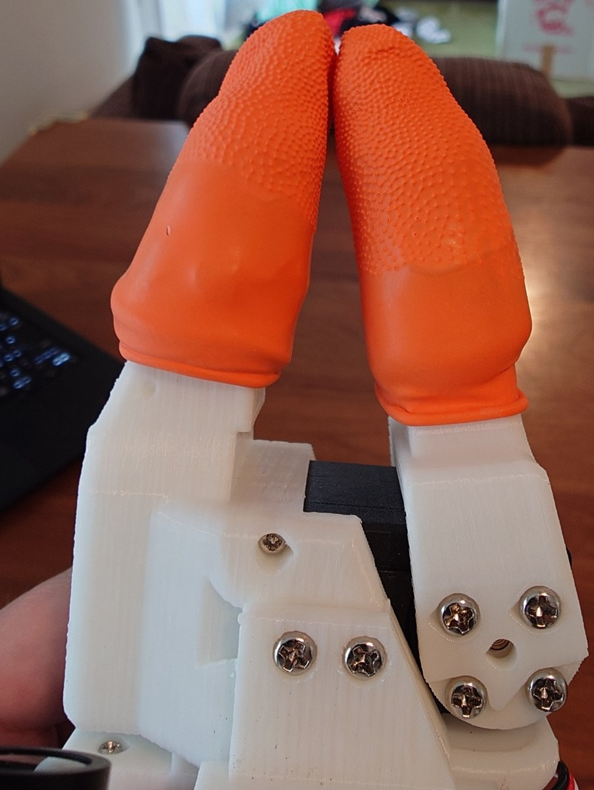

# ものごころ=MONOGOKORO, Thinks of Things, 物心

[日本語](README.md) | [English](README_EN.md) | **简体中文**

本仓库为 LeRobot-ACT-SO-101 技术栈实现「运动神经」。

是通俗意义上的运动神经 —— 也就是脊髓反射和小脑，而不是解剖学意义上的那个（α 运动神经元）。
后者在 STS3215 内部，而它没有主机可写的力矩寄存器，因此成了本 fork 自始至终唯一没能触及的一层。

这是 [LeRobot](https://github.com/huggingface/lerobot) 的一个 fork，为 SO-101 补上位于策略*之下*的
两层运动层。其一是**脊髓反射**，让关节和夹爪顺着接触卸力而不是硬推过去；其二是**小脑**，它在线学习
在反射感受到负载之前就把负载抵消掉。ACT 看到由此产生的力，并指令要以多大的力度去抵抗。第三层比这
两层都更低，而且根本不是软件 —— 柔软的指尖，它对接触的应答比这里任何一个回路都快。

已与上游同步至 [`d36d404b`](https://github.com/huggingface/lerobot/commit/d36d404b)
(2026-08-31, 0.6.2 线)。上游的功能全部原样可用 —— 本 fork 只增加了一种机器人、一个实时控制器、
一层在线学习的前馈，以及 ACT 推理对象上多出的两个维度。策略的架构没有做任何改动。

## 为什么

被称作「Physical AI」的东西，绝大多数讲的都是大脑皮层的故事。真正触碰物理的那一层 ——
实时应答接触的那一层 —— 一直空着。

目标是只用谁都买得到的硬件和谁都读得懂的软件，把策略以下的层做出来。不是实验室的装置：3D 打印的
机械臂、业余级舵机、一台笔记本、一个主线内核，以及本来就装在里面的集成 GPU。

原版 SO-101 的控制是写 `Goal_Position`，让舵机内置的 PID 驱动过去。这个控制器没有「接触」这个概念。
被物体挡住时，它会朝着一个永远到不了的位置继续加大输出。薯片会在机械臂能被称作「感觉到了」之前
就碎掉。而且策略这一侧也没有区分*用力按*和*轻轻托住*的词汇 —— 它能说的只有 `Goal_Position`。

生物并不是在大脑里解决这件事的。牵张反射是一个在脊髓内闭合的弹簧-阻尼器，而下行指令指定的不是力。
它指定的是平衡位置，以及经由 γ 运动神经元设定的该反射的*增益*。

只有反射还不够，而且不足的量是可以算准的。反射只能应答已经发生了的误差，所以承担恒定负载的关节会
永远停在目标以下 `holding_duty / K` 的位置。反馈律要缩小这个下垂，唯一的办法是提高 `K` —— 也就是把
本来要提供的柔顺性收回来。在误差出现*之前*把负载抵消掉是另一件工作，生物把它交给了另一个结构。

所以这里有四层，每一层待在现在的位置都有其理由。

|                            | 生物               | 这里的实现                                           | 频率     |
| -------------------------- | ------------------ | ---------------------------------------------------- | -------- |
| 不经任何回路就应答接触     | 预反射：肌肉与组织 | 每个夹爪面上叠三层硅胶指套，外面再套一层天然橡胶指套 | —        |
| 不经大脑的快速局部回路     | 牵张反射           | Rust 守护进程、`SCHED_FIFO`、隔离核心                | 400 Hz   |
| 从自身误差中学习出来的预测 | 小脑               | 集成 GPU 上的 Vulkan 计算、独立线程                  | 200 Hz   |
| 经过感知的慢速回路         | 视觉反馈           | ACT                                                  | 约 30 Hz |

反射与 ACT 之间约 13 倍的间隔，大致就是生物在跑的比例，也是控制律不住在 Python 里的原因。小脑位于
两者之间，并且如其名所示位于反射弧的*外侧* —— 它从不进入回路，却修正着回路。

脑桥核在这张表里没有行，因为它不是一层，而是一条**通路** —— 它只把上下文从栈顶送下来交给小脑的苔藓
纤维，自己不闭合任何回路，因此也没有自己的频率。它送下来什么、以及刻意不送什么，见
[第 5 节](README_DETAILS_CN.md#5-告诉小脑它握着什么的脑桥核)。

最上面那一行是本仓库里最便宜的东西，也可能是最有效的东西。接触的瞬态比这张表里任何回路都快 ——
指尖碰到物体那一刻的力上升过程，在反射 2.5 ms 的一个 tick 内部就结束了，所以*最先*应答它的东西不可能
是控制器。生物给出的答案是**预反射 (preflex)**：肌肉与组织自身固有的机械响应，不经过反射弧、以零延迟
返回。在这里它就是每个夹爪面上叠起来的硅胶指套（防皲裂用的厚款，壁厚约 2 mm，手上这批是 Rimikuru 的手指保护套，不是办公用来数纸的薄指套），
也正是有柔软手指的动物能粗手粗脚地对待易碎物、而这条机械臂不能的原因。
**硅胶直接裸露着用，大约两周就裂开了**（2026-09-16 发现）；现在在外面再套一层
**天然橡胶指套**（表面带防滑颗粒）来保护它。

<p align="center">
  
</p>

它还提高了夹爪触觉的分辨率。这一点稍微不那么直观。握力本来就读得到 —— 接触之后只有指令位置继续前进而实际
位置停住，所以 `pwm = K * err` 会跟随握的力度。柔软指尖改变的是它的*刻度*。同样的力的范围被摊开到多得多
的编码器计数上 —— 称重传感器之所以有弹性体，正是为了把力变成足以测量的位移。信号从一开始就在那里，
软指尖给了它一把更细的尺。这条机械臂上到底细了多少还没有测 —— 而有一个候选因素可能把整个效果吃干净，
它就在[已知限制](#已知限制)里的静摩擦。

这四层里没有一个新想法。阻抗控制是 Hogan, 1985。在颗粒层做扩展、线性读出、由攀缘纤维教学的构成是
Marr・Albus・Ito，而 Albus 在 1975 年就用它做过控制器。在传感器前面串一段柔顺、把力变成足以测量的
位移，就是 1995 年以来的串联弹性驱动器本身。用位置误差驱动的双边遥操作，比上面任何一个都更老。

新的是它们运行的地方。这些当年都附着在个人买不起的硬件上 —— 可力矩控制的机械臂、为了闭合快回路的
dSPACE 或 DSP 板卡、为了跑学习的像样的计算机。这四样今天装得进一台笔记本。自适应层跑在一开始就装在
里面的集成 GPU 上，实时回路跑在原版内核上 —— PREEMPT_RT 进入上游是 2024 年，这件事变成理所当然到
现在也才两年左右。

所以这里的贡献不是机制。是移植，以及随之而来的数字：Marr-Albus 那一层在 Arc 140V 上实际要花多少、
为什么它不能放进控制 tick 里面、业余级舵机的总线在 400 Hz 下会发生什么。这些查资料都查不到。下面
的实测一节之所以那么长，就是这个原因。

## 这个 fork 增加了什么

```
   operator's hand                                                        camera
        │  ▲                                                                 │
   ┌────┴──┴────┐                                                            │
   │ SO-101     │  gripper: force feedback ──┐                               │
   │ leader     │  5 joints: backdriven      │                               ▼
   └────────────┘                            │                    ┌──────────────────┐
        │ pos                                │                    │ ACT              │
        ▼                                    │                    │                  │
   ╔═══════════════════════════════════════╗ │                    │ in:  images      │
   ║ Rust RT daemon  ·  400 Hz             ║◄┘   shared memory    │      pos    ×6   │
   ║ SCHED_FIFO, isolated core             ║◄──── seqlock ───────►│      current×6   │
   ║  pwm = K·Δx + D·Δv + ff   (6 motors)  ║                      │                  │
   ║  owns both serial buses               ║                      │ out: pos ×6 ┐    │
   ╚═══════════════════════════════════════╝                      │      K   ×6 ├ ×N │
     │ PWM   ▲ pos, current    │ state  ▲ ff                      │      D   ×6 ┘    │
     ▼       │                 ▼        │                         └──────────────────┘
   ┌───────────┐          ╔═════════════════════════╗
   │ SO-101    │          ║ cerebellum · 200 Hz     ║
   │ follower  │          ║ Vulkan on the Intel iGPU║
   │ 6×STS3215 │          ║ 16384 granule → 6 PC    ║
   └───────────┘          ║ three-factor Hebbian    ║
                          ╚═════════════════════════╝
```

**各层的详细说明在 [README_DETAILS_CN.md](README_DETAILS_CN.md)** —— 怎么做的、为什么、以及什么没有奏效。

## 快速开始

```bash
# 1. 构建，并只授予一个必要的特权 capability。setcap 每次重新构建都会丢失。
cd rust/so101_impedance_ctrl && cargo build --release
sudo setcap cap_sys_nice+ep ./target/release/so101_impedance_ctrl

# 2. 启动守护进程。它必须在 Python 挂上来之前就在运行。
#    不加 RUST_LOG=info 就什么日志都不会打印。小脑实际取到的 backend 和首次电压读数
#    只在那里出现。
RUST_LOG=info ./target/release/so101_impedance_ctrl \
  --port /dev/ttyACM0 --shm-name so101_impedance --cpu-core 3 --priority 99

# 3. 确认遥测。此时机械臂力矩关闭，处于可以用手搬动的安全状态。
python examples/check_so101_impedance.py --shm-name so101_impedance
```

第 3 步是第一个需要 Python 环境的地方，搭建方法见 [`SETUP_XPU.md`](SETUP_XPU.md)（英文）。第 1〜2 步的守护进程是 Rust 写的，没有 Python 环境也能单独运行。

之后用 `--robot.type=so101_follower_impedance` 去做遥操作或录制即可。两者都会从机器人配置里自动填入
每个关节的 K/D。

小脑是可选加入的。在步骤 2 里加上下面这些（构建需要 `glslc`，运行需要 Vulkan ICD，另外还需要一个
**与 `--cpu-core` 不同的**杂务核心）。

```bash
  --cerebellum-backend gpu --cerebellum-cpu-core 1 \
  --cerebellum-weights ~/.local/share/so101/cerebellum.bin
```

- 隔离核心的配置：[`rust/so101_impedance_ctrl/PREEMPT_RT.md`](rust/so101_impedance_ctrl/PREEMPT_RT.md)
- 增益调整、小脑上电、协议注意事项：[`rust/so101_impedance_ctrl/README.md`](rust/so101_impedance_ctrl/README.md)
- LeRobot 的一般用法（录制、训练、评估）：[`AGENT_GUIDE.md`](AGENT_GUIDE.md)

## 实测值而非假设

开发机是 ThinkPad X1 Carbon Gen 13 —— Core Ultra 7 258V (Lunar Lake)，集成 GPU 为 Arc 140V。下面列出
的数值里，有几个是在文档上的值或者直觉上的值被证明是错的之后，在这台实机上定下来的。它们是这台机器
特有的值，换一个环境值得重新测。

| 对象               | 值                                        | 是怎么定下来的                                                                                                                                                                   |
| ------------------ | ----------------------------------------- | -------------------------------------------------------------------------------------------------------------------------------------------------------------------------------- |
| PWM 的符号位       | **10**                                    | 用位 11（上游 docstring 上写的那个）时关节不会反向 —— 它被当成额外的幅值消耗掉了                                                                                                 |
| `--invert-pwm`     | **true**                                  | 即使用了正确的符号位，正的占空比仍然会让编码器读数下降                                                                                                                           |
| 每关节的 K         | 10/20/15/10/8/5                           | 让它以 K=1 保持，上报的 PWM 就可以读成各关节抵抗重力+摩擦所需的占空比                                                                                                            |
| 每关节的 D         | 约 K/40                                   | 给出上限的不是稳定性，而是速度的量化噪声底                                                                                                                                       |
| 手腕立体视觉的基线 | **55 mm**                                 | 从视差估计出 57.8 mm，用尺子量出 55 mm。这 5% 的差是叠加在视差上的一个常数旋转偏移（+39 px），它和在垂直方向上独立测到的 +42 px 一致                                             |
| 录制分辨率         | **640x360**                               | 这个摄像头的 4:3 模式不是增加高度，而是把宽度裁掉 25%。在 640x480 下立体重叠区从 58% 降到 43%，而且比 640x360 多花 25% 的像素。ACT 不做缩放，所以像素数直接就是训练成本          |
| iGPU 的计算队列    | **1**                                     | 队列族 1、队列 1，而且和图形共用 —— 无法把计算提交调度成避开合成器，隔离 CPU 也改变不了任何事                                                                                    |
| 小脑的单步         | 空闲时平均 307 µs，**负载时最大 2969 µs** | 单步有可能超过整个 2.5 ms 的控制周期。最大值在改变层规模后几乎不动，所以它是提交抖动而不是计算                                                                                   |
| ACT 单次前向       | **30 ms**（bf16）、44 ms（fp32）          | 集成 GPU 上，两路 480x640 摄像头；单路是 16 ms，可见视觉占大头。`n_action_steps` 默认 100，所以 30 Hz 的机器人每 3.3 秒推理一次 —— 占用率 0.9%。`examples/load_igpu_with_act.py` |

完整的 A/B 测量在 [README_DETAILS_CN.md](README_DETAILS_CN.md)。

<p align="center">
  
</p>

上表中手腕立体视觉的那两行，可以在这张照片里读出来。摄像头是两块 InnoMaker U20CAM-1080P
（1080P USB2.0 UVC）。镜头是广角的，看一眼就知道。每块摄像头板只用对角两颗铜柱固定，
也是看一眼就知道 —— **用的是 M2.6 的六角铜柱，直接自攻进 3D 打印件里**。
而这正是叠加在视差上的那个常数偏移最有可能的来源。寄存器和特征匹配都没说到这一步。

## 已知限制

- [脑桥核的上下文尚未在实机上验证](README_DETAILS_CN.md#脑桥核的上下文尚未在实机上验证)
- [小脑的下垂数值已重做](README_DETAILS_CN.md#小脑的下垂数值已重做) —— 2026-08-28 那批予以撤回。
- [前馈没有收敛而是衰减了](README_DETAILS_CN.md#前馈没有收敛而是衰减了) —— 已修复，修正值尚未实测。
- [触觉没有位置也没有打滑](README_DETAILS_CN.md#触觉没有位置也没有打滑)
- [能学到什么由苔藓纤维决定](README_DETAILS_CN.md#能学到什么由苔藓纤维决定) —— 缺的是相机来的特征。
- [演示不给出策略以下各层的标签](README_DETAILS_CN.md#演示不给出策略以下各层的标签)
- **开环 PWM** —— STS3215 没有主机可以流式写入的力矩寄存器。比真正的力矩控制噪声更大，但这是硬件约束而不是选择。
- [随附的电源在默认设置下就会塌陷](README_DETAILS_CN.md#随附的电源在默认设置下就会塌陷) —— 329 秒里一次 833 ms。**换成市售的 5 V 6 A 电源，默认设置下就不再出现**（只需换个插头，已实测）。
- [通信错误的真正原因是电源](README_DETAILS_CN.md#通信错误的真正原因是电源)
- [换电源之后塌陷没有全部消失](README_DETAILS_CN.md#换电源之后塌陷没有全部消失)
- [单周期的 bit0 没有随电源消失](README_DETAILS_CN.md#单周期的-bit0-没有随电源消失)
- [自制 7.4 V 电源](README_DETAILS_CN.md#自制-74-v-电源) —— 想要更多余量的话。要焊接。
- **守护进程不包含在 Python 的构建里。** 它是独立的 Cargo 项目，需要手动部署。
- [交互式标定尚未实现](README_DETAILS_CN.md#交互式标定尚未实现)
- [iGPU 训练的 OOM 会把桌面搞崩](README_DETAILS_CN.md#igpu-训练的-oom-会把桌面搞崩) —— cgroup 防不住。

## 上游

除上面列出的内容以外，全部都是未经改动的上游 LeRobot，包括其他机器人、策略、数据集和脚本。上游的
文档可以原样适用。

- [Documentation](https://huggingface.co/docs/lerobot) · [Hub](https://huggingface.co/lerobot) · [Discord](https://discord.gg/q8Dzzpym3f)

```bibtex
@misc{cadene2024lerobot,
    author = {Cadene, Remi and Alibert, Simon and Soare, Alexander and Gallouedec, Quentin and Zouitine, Adil and Palma, Steven and Kooijmans, Pepijn and Aractingi, Michel and Shukor, Mustafa and Aubakirova, Dana and Russi, Martino and Capuano, Francesco and Pascale, Caroline and Choghari, Jade and Moss, Jess and Wolf, Thomas},
    title = {LeRobot: State-of-the-art Machine Learning for Real-World Robotics in Pytorch},
    howpublished = "\url{https://github.com/huggingface/lerobot}",
    year = {2024}
}
```

与上游相同，采用 Apache 2.0。参见 [LICENSE](LICENSE)。
