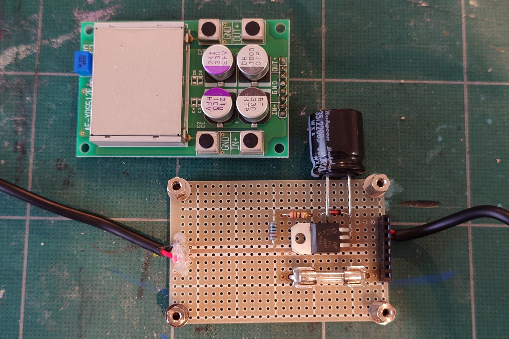

# ものごころ=MONOGOKORO, Thinks of Things, 物心 — 详细

[日本語](README_DETAILS.md) | [English](README_DETAILS_EN.md) | **简体中文**

← 返回 [README_CN.md](README_CN.md)

README 中「这个 fork 增加了什么」的分层详述、「实测值而非假设」中的 A/B 测量，以及「已知限制」里每一条的正文。

## 这个 fork 增加了什么

### 1. 跑在 PREEMPT_RT 隔离核心上的阻抗控制

[`rust/so101_impedance_ctrl/`](rust/so101_impedance_ctrl/) 是一个独立运行的 Rust 守护进程，它独占从臂
(follower) 的串口总线，并执行：

```
pwm = clamp(K · (target_pos − present_pos) + D · (target_vel − present_vel))
```

对**包括夹爪在内的全部 6 个电机**，在用 `isolcpus` 隔离出来的核心上钉住的 `SCHED_FIFO` 线程里以
**400 Hz** 运行。Python 完全不碰总线，目标值与遥测的交换经由 seqlock 保护的 `#[repr(C)]` 共享内存段进行。

没有把夹爪留在位置控制上是刻意的。把薯片压碎的正是刚性的夹爪，所以夹爪也走和机械臂相同的 K/D 律，
只是默认 K 要软得多。

这是开环 PWM，因为 STS3215 不存在主机可以流式写入的力矩寄存器。它比真正的力矩控制更嘈杂 ——
这是接受下来的取舍，不是被藏起来的东西。

回路频率的约束来自舵机链路而不是 CPU。每个 tick 有 3 次总线事务，每次 USB 往返约 256 µs，合计约
0.8 ms，而周期是 2.5 ms。**实测的 tick 更长**：在总线健康的区间里平均 1.1-1.5 ms
（2026-09-09，默认设置；加 `--current-read-divisor 4` 为 1.1 ms），约为上述理论值的 1.5 倍，
余量仍然充足。超过 400 Hz 也得不到什么 —— 决定这条机械臂手感的是开环 PWM 和齿轮摩擦，
而 400 Hz 已经远远超过机械臂的机械带宽。

### 2. 主臂夹爪的力反馈

加上 `--leader-port` 之后，同一个回路也会把**主臂 (leader)** 的夹爪当作触觉显示器来驱动，操作者就能
感觉到从臂正握着什么。主臂剩下的 5 个舵机保持力矩关闭，维持可反向驱动。

力不是来自力传感器，而是从从臂自身的跟随误差导出的。自由的夹爪能到达目标，所以扳机保持松弛；被挡住
的夹爪则是指令位置跑到了实现位置前面，而这个差会随着操作者要求握得多紧而变大。

两条臂共享**单核上的单个回路**。端口是分开的，所以半双工的约束不会把两者耦合起来，而且一个 tick 内
两条臂的采样是同步的 —— 若拆成两个独立回路，相位就会自由漂移，耦合处会引入一个周期量级的可变延迟。
而那正是让双边回路不稳定的东西。

### 3. ACT 处理力与柔顺

`modeling_act.py` 没有改动。两个投影的维度都是从特征形状导出来的，所以只要把机器人声明的特征加宽
就够了。

|                           | 原版 SO-101      | 本 fork                                                                          |
| ------------------------- | ---------------- | -------------------------------------------------------------------------------- |
| `observation.state`       | `pos` ×6 → **6** | (`pos` + `current_avg` + `pwm_cmd` + `ff_pwm`) ×6 + 电源电压 + 小脑标志 → **26** |
| `action`（每个 chunk 步） | `pos` ×6 → **6** | `pos` ×6 + `K` ×6 + `D` ×6 → **18**                                              |

**输入。** 每个电机的 `Present_Current` 以每 tick 一个舵机的轮询方式采样，并在 Rust 侧在一个固定窗口
（默认约 0.5 s）上取平均。ACT 以相机的频率读到已经平均过的值，因此它看到的是接触力，而没有逐 tick 的
噪声。电源电压之所以并排放进来，是因为没有电源轨读数的电流，和机构变硬是区分不开的。

两列 duty 是回路自己的申报。`ff_pwm` 是小脑的贡献量，`pwm_cmd` 是总量，所以两者之差就是反馈分量 ——
也正是攀缘纤维所依据的那个量。把两者都记下来，是**事后**才能判定哪些帧有价值（小脑在哪里没能预测对）
的前提条件，也是不必在录第一段数据之前就把这件事定死的原因。外壳温度是刻意没有放进来的：那是健康
轮询最后读到的某一个舵机的温度，要如实记录的话，就得把轮询的 ID 也作为一列带上。

**输出。** ACT 的动作分块没有变 —— 依然预测到 `chunk_size` 步之后 —— 但每一步除位置之外还携带每个
关节的刚度和阻尼。策略在自己的预测区间上自行选择自己的柔顺性。K/D 在 Python 侧钳位，在到达舵机之前
又在 Rust 侧再钳位一次。

### 4. 在集成 GPU 上在线学习的小脑

[`rust/so101_impedance_ctrl/src/cerebellum/`](rust/so101_impedance_ctrl/src/cerebellum/) 预测那些
放着不管就会被反射作为稳态误差扛下来的负载。

```
pwm = K·(x_t − x) + D·(v_t − v) + ff(sensory state)
```

结构是 Marr-Albus-Ito，并且原样映射到硬件上。

| 小脑           | 这里的实现                                                                |
| -------------- | ------------------------------------------------------------------------- |
| 苔藓纤维       | 30 路信号 —— 每个关节的编码器相位 `sin`/`cos`、速度、跟随误差、电流       |
| 颗粒细胞       | 16384 个单元。每个单元通过**固定随机**、从不被学习的投影读取 4 根苔藓纤维 |
| 高尔基细胞抑制 | 一个全局阈值。位于对实测稀疏度（使活性保持在约 2%）的反馈回路上           |
| 平行纤维       | 该稀疏编码的归一化结果。携带约 150 ms 的资格迹 (eligibility trace)        |
| 浦肯野细胞     | 线性读出，输出 6 路 —— **唯一被学习的层**                                 |
| 攀缘纤维       | 反射自身的稳态占空比                                                      |

```
ΔW = rate · (cf · e  −  leak · W · e)
```

三个因子 —— 平行纤维的资格迹、攀缘纤维，仅此而已。有 `leak` 项，它才是*修正型*赫布律而不是发散。
朴素的赫布乘积只在误差符号一致时才增长，而那恰恰正是重力所产生的东西。两项都由攀缘纤维是否活着来
门控。`cf` 为零不是「误差为零」而是「没有误差信号」，此时若只让衰减继续跑，就会把那个已经消掉误差的
前馈本身拆掉。

**没有反向传播，也不需要。** 拥有可变突触的层只有一个，而它的误差已经用与输出相同的单位（PWM）表达。
因此反向传播要解决的那个信用分配问题根本不会发生。作为代价支付的不是深度而是参数量 —— 用 16k 个
颗粒细胞去换一个学习过的隐藏层几百个单元就能得到的可分离性。而这恰好是闲着的集成 GPU 免费吸收掉的
那种取舍。

教师信号就是守护进程每个 tick 已经在算的量。弹簧*仍然*必须保持的占空比，按定义就是预测没能抵消掉的
那一份。所以学习是在线且无条件的 —— 没有数据集、没有训练阶段、没有回合边界。机械臂在被遥操作时、
被 ACT 驱动时、原地静止不动时，都在学习。给 `--cerebellum-weights` 指定一个文件，学到的内容就会
跨运行累积。

小脑绝不会跑在控制回路内部。让这一点不可让步的两个数值，见
[实测值而非假设](README_CN.md#实测值而非假设)。交接双向都走 seqlock，所以慢下来的小脑或死掉的小脑都无法让反射
停住；只要这块集成 GPU 没有背着控制之外的重活，延迟本身也不会丢掉什么 —— 因为要预测的负载是准静态的
（见[已知限制](#已知限制)）。

**默认关闭**，而且在保持中途开启也是安全的。权重从零开始，所以未学习的网络其贡献正好是零。输出被
钳位、双向都有压摆率限制，并且会被反射所拥有的一切失效保护清零。夹爪被完全排除在对象之外 ——
学习自己握力的夹爪，会在对象已经不在之后还继续握着。安全包络与调参细节见
[`rust/so101_impedance_ctrl/README.md`](rust/so101_impedance_ctrl/README.md#cerebellum-an-adaptive-feedforward-on-the-igpu)。

### 5. 告诉小脑它握着什么的脑桥核

到目前为止的苔藓纤维只携带本体感觉，所以小脑区分不了两种载荷。20 g 和 200 g 会沿着同样的关节角度
走向同样的目的地，差别要等负载把机械臂拽下来*之后*才出现 —— 而前馈存在的全部理由，就是不让那件事
发生。[`rust/so101_impedance_ctrl/src/pontine.rs`](rust/so101_impedance_ctrl/src/pontine.rs) 从策略层
往那个苔藓纤维向量的尾部追加 2 条通道。从 30 路信号变成 32 路。

脑桥核中继的是**同一性，不是重量**。不会去问策略「有多少克」。生物是把物体本身交给小脑，把重量→力的
换算放在小脑那一侧 —— 握力在物体被举起*之前*就已经缩放正确，而这份记忆是挂在物体的同一性上的。让
策略吐出克数，等于把小脑的工作往上抬了一层，并且要求一个在这个回路里没有办法教的标定。

而且脑桥核**不计算**。就一个一阶滞后滤波器，此外什么都没有。展开成可分离的编码这件事，已经由固定
随机投影之上的 16384 个颗粒细胞承担了，所以在这里再放一层就是重复劳动。更何况若放一层*会学习*的，
就得把它的误差穿过颗粒层和浦肯野层反向送回去 —— 那正是这个设计没有、也不想要的信用分配。在源码树上
把它放在小脑的兄弟位置，是因为在脑干里也是如此。

**这条通道现在有了供给方，只是内容还是常量。** `--robot.pontine_context` 让操作者声明自己正在演示的是
两个无法区分的情境中的哪一个。`send_action` 把它钳位到 `[-1, 1]` 后写进共享内存，`PontineContextProcessorStep`
把它作为名为 `context.<i>` 的动作列记录下来。记录成**动作**是关键 —— ACT 自身没有上下文变量（CVAE 的
隐变量在结构上于推理时被固定为零），但如果上下文存在于它要学着复现的动作里，它就能学会从图像输出
上下文。一开始它只是复现被记录下来的常量，这和 `.k`/`.d` 那些列的局限是一样的。`--cerebellum-context`
依然可以手动固定，并且会绕过共享内存和滞后滤波器两者。跑基准要的正是后者。
有两个常量出自 CPU 参考实现而不是实机，现在成了回归测试。**每条通道要用 `±1` 来摆动**（不要做成
`0/1` 的标志位。只有一根不同的纤维时，80 个计数的可分离性里只能拿到 64，两根则能拿到全部 80。
成本相同），以及**训练时要交替切换上下文**（不要把一边学到收敛再学另一边。大多数颗粒细胞根本没有
拉到上下文纤维，所以权重是共享的，按块训练会让第一个上下文本该是 40 的地方返回 98）。后者由
`--robot.pontine_context_cycle` 逐回合轮换，所以一次录制运行内部就是交替的。

## A/B 延迟测量

小脑单步和 ACT 单次前向这两条，就是小脑拥有专用线程而不是 tick 里一个时隙的理由。它实际上会不会碍事，没有靠假设而是
去确认了 —— 每个条件 20 s × 3 次交替进行，每个条件 10800 个控制 tick。（这是对着一个桩串口做的，
所以 tick 的绝对成本由超时主导，单看它没有意义。这里做的是*比较*。）

| 控制回路           | 平均 tick | 超周期     | 最差 tick |
| ------------------ | --------- | ---------- | --------- |
| 小脑关闭           | 3219 µs   | 10 / 10800 | 7344 µs   |
| 小脑在 iGPU 上开启 | 3228 µs   | 9 / 10800  | 10971 µs  |

平均成本和超周期率区分不开。最差 tick 在*两*列里都在毫秒量级上摆动 —— 有一轮里本该安静的那一侧反而
给出了更差的离群值 —— 所以这条尾巴是笔记本的，不是小脑的。

**策略推理跑在同一块集成 GPU 上的情形，也用同样的办法查了**（2026-09-04：pty 上的死总线、无可塑性、
没拿到 `SCHED_FIFO`、每个条件 25 s，负载来自 `examples/load_igpu_with_act.py`）。

| 条件                                                     | 小脑单步均值    |
| -------------------------------------------------------- | --------------- |
| 只有小脑                                                 | 588〜646 us     |
| ＋ ACT 推理（每 3.3 秒一次，即默认 `n_action_steps`）    | 504〜605 us     |
| ＋ ACT 推理（背靠背，即 temporal ensembling 的最坏情况） | **311〜427 us** |

三个条件都没有丢掉任何一个 200 Hz 的步（每 3 秒 600〜604 步），零错误、零拒绝。**负载越重，小脑反而
越快。** 这个尺寸的一次派发，成本在提交延迟而不在计算，而空闲的集成 GPU 已经降了频 —— 持续负载把它
一直叫醒着。本来是为了找争用才测的，结果争用不存在，存在的效应还是反过来的。

重新推导这些数值的工具也一并带上了。`--probe-direction` 用一个限定范围、会自动中止的小幅轻推来测量
驱动方向。检查器的实时表格能把「太软了」和「在往反方向驱动」区分开（离远了看这两者是分不出来的）。
`cargo test --test cerebellum_gpu_tests -- --nocapture` 会在你当前所在的主机上重新打出延迟表。

## 已知限制

README [已知限制](README_CN.md#已知限制)里每一条的正文。README 那边只列条目名，条件和来龙去脉在这里。

### 脑桥核的上下文尚未在实机上验证

**脑桥核的上下文通道尚未在实机上验证，而且还没有任何东西能 _推断_ 它。** 连线是从头通到尾的 ——
从配置到共享内存再到苔藓纤维。演示时的上下文也会作为动作列被记录下来。但那两个常量是对着 CPU
参考实现而不是真机测出来的，而且在策略学会从图像预测之前，它只是原样复现操作者打的标签值。

### 小脑的下垂数值已重做

**小脑的下垂数值已于 2026-09-08 重做；2026-08-28 那批予以撤回。** 旧会话在 K 不变的情况下报告了
`shoulder_pan` 3.00 → 0.00、`elbow_flex` 9.00 → 0.00、`shoulder_lift` 12.57 → 3.00 个计数的下垂，
这些全都不要采信。`shoulder_pan` 的功率级短路了，每次往它写入都会让共享电源轨从 4.6 V 掉到 2.4 V，
持续约 820 ms。本页此前写过「两侧都在同一个故障下运行，所以*比较*仍然成立」——这是错的：故障是从
会话中途才开始的，每一轮跑在故障的哪一侧决定了效果的方向，而且 CSV 已经丢失。
**重做后的数值**（电源轨均值 4.52 V、最小 4.50 V；各轮共用同一个 pose 文件；K 保持不变；腕部载有
两台立体相机）：下垂为 `shoulder_lift` 5.00 → 1.02、`elbow_flex` 21.00 → 1.00 个计数。
当路径上只有 PD 律时，`err = pwm / K` 是一个**恒等式**：它精确到小数位地成立是算术的结果，
不是测量正确的证据。标准差 0.00 也只说明手臂静止，而**静止无法区分平衡与静摩擦卡住**。
在完全相同的设置下跑四轮，`shoulder_lift` 的保持占空比分别是 100 / 180 / 200 / 255，每一轮的标准差都是 0.00。**保持占空比不是一个值，而是
一条带。** 用从上方和从下方接近同一目标的方法测得，这条带在 `shoulder_lift` 上宽 18.0 个计数
（占空比 120 与 480）、在 `elbow_flex` 上宽 12.9 个计数（占空比 300 与 106）——**与它所包围的保持占空比同一量级**。
100/315 不是这条带的值，而是从上方接近时的一个边缘（`--approach-from`，2026-09-09，电源轨
4.40-4.51 V，外壳温度 26-32℃，相对湿度 25%）。ff 的读数仍会随 `--cerebellum-cf-deadband` 变成
路径相关的量。另外，
两个关节撞到 `--cerebellum-ff-max` 这件事**并没有被抬高**：在电源轨健康的情况下，`elbow_flex` 依然
需要 315，依然会撞上 300 的钳位。**一个在正常运行中就会触发的钳位，无法区分正常与异常**，因此它的
取值需要重新安置——尚未动手，因为 315 只是一个姿势下那条带的一个边缘，其他姿势下的正当上限还没有测过。

### 前馈没有收敛而是衰减了

**前馈没有收敛，而是衰减了。已修复，但修正值尚未实测。** 两次学习运行里，关节完全静止不动，却以
几分钟的时间常数衰减下去，等到机械臂打滑时又弹回到钳位值。原因不在机械臂，而在学习律。衰减项只由
资格迹门控，没有由攀缘纤维门控，于是平衡点是 `w = cf / leak` —— 也就是说结构上**需要稳态误差才能
保住权重**。它留下的残差不到 1 个 PWM 计数，比摩擦带还要窄，而在摩擦带内部关节动不了，也就根本
无法报告误差。现在两项都由攀缘纤维门控，`--cerebellum-cf-deadband`（默认 5.0）决定「反射保持沉默」
的边界。**这个默认值已于 2026-09-08 在一条健康的机械臂上测过，结论是太低了。**
它当初是这样推导的：「高于泄漏残差，低于 1 个编码器计数 × 关节刚度」——但位置是量化的，误差根本
到不了零。`wrist_flex`（K=10）的误差在 ±2 个计数之间往复，反馈占空比因此从不低于 20，也就永远进不了
5 的带内；结果 ff 以 **69 秒的周期**在 0 与 126 之间来回摆动。把它提高到 25 之后振荡完全消失
（173 秒内变化不到 0.2 个计数，数值也在真值的 4% 以内）——但误差一进入带内 ff 就被冻住，于是
**它不再是负载的测量值，而变成「过渡过程冲到了哪里」的函数**。倒向哪一边尚未决定。传 `0` 会回到旧行为。
**摩擦带不是电源掉电的副产物** —— 2026-09-09 分开了：电源轨健康（均值 4.44-4.51 V、
最小 4.40 V）时这条带依然出现。这条带的宽度，以及它与保持占空比同一量级这件事，
测量值在[小脑的下垂数值已重做](#小脑的下垂数值已重做)一节。

### 触觉没有位置也没有打滑

**触觉只到「多用力」为止。没有「在哪里」和「是否在打滑」。** 柔软的指尖把握力变成编码器计数，而
这就是这里触觉的全部：每根手指一个标量，以 400 Hz 送达反射。碰到了手指的哪个位置，以及告知物体
*开始*打滑的微振动，两者都需要专用传感器而不是通用零件 —— 而本仓库想展示的正是：没有它们，这套栈
能搭到什么程度。腕部相机能以约 30 Hz 看到打滑*已经发生*，但看不到打滑开始。

### 能学到什么由苔藓纤维决定

**能学到什么由苔藓纤维决定。** 苔藓纤维携带的是姿态、速度、跟随误差、电流，所以重力、关节摩擦、
固定负载都能学 —— 但没有任何东西告诉它夹爪里的是两个载荷中的哪一个，所以它区分不了。摄像头来的
特征是明显缺失的那一束。

### 演示不给出策略以下各层的标签

**演示不会给出策略以下各层的标签。** 力矩关闭的主臂只是一个位置传感器，回合会被打上配置里默认
K/D 作为标签。用它训练出来的 ACT 学到的是复现那些默认值的方法，而不是改变增益的方法。小脑的权重
同样只是留在文件里，不会进入数据集。主臂夹爪的力反馈是修正前半部分的第一步，而从多次演示之间的
方差里导出刚度，大概是接下来的一手。

### 随附的电源在默认设置下就会塌陷

**用随机附带的 5V4A 适配器，这个 fork 在默认设置下电源轨就会塌。** 频率和条件见
[换电源之后塌陷没有全部消失](#换电源之后塌陷没有全部消失)，分开的经过见
[通信错误的真正原因是电源](#通信错误的真正原因是电源)。这里只放症状出现之前就该知道的事。

- **不是说手臂跑不起来。** 它跑得起来，只是会间歇性地塌。
- **症状里完全不提电压。** 电源轨塌下去的时候舵机的回复会被扰乱，到主机这边只是一个读取超时。
  只看占空比那几列的话，它和「增益太软」无法区分 —— 这里当初就是这么误读的。
- **上游的位置控制会不会也这样，没有测过。** 原版 `so101_follower` 写 `Goal_Position`，
  由舵机内部的 PID 去驱动，但抵抗重力抬起手臂所需的电流，两种控制都一样要。
  **「以前从来没见过」不能算证据** —— 错误字节被丢掉了三周，所以「上游也在塌、只是没人看见」
  这种可能性并没有被排除。

**该怎么做，以及能买到什么。两条路，这里只测过其中一条。**

_测过的。_ 换一个更大的 5 V 电源 —— **稳压 5 V、6 A 以上、5.5×2.1 mm 中心正极**。
这正是手臂本来就在用的插头，所以直接换上即可。挑候选时要看的是标称的 **load regulation**（负载调整率），
而不是最大电流（「4 A」是上限，并不保证到达途中电压会怎样）。**标签上不会写**，
所以这要从数据手册或产品页上找。换了之后的结果见
[换电源之后塌陷没有全部消失](#换电源之后塌陷没有全部消失)。

_测过了，2026-09-16。_ 让舵机跑在它被设计的电压上。STS3215 是一款 **7.4 V** 的舵机，而标准配置
让它跑在 5 V：厂商标注的是 **6-7.4 V**，额定力矩只在 6 V 和 7.4 V 下给出，**从来没有在 5 V 下
给过**。跑在范围的下端会损失力矩，而损失掉的力矩要用电流来还 —— 而电流正是把电源轨拖下去的那个
东西。这条手臂上舵机自己的 `Max_Voltage_Limit` 读数是 80（8.0 V），所以 7.4 V 在它们能接受的
范围之内。**2026-09-16 做了一台 24 V → 7.4 V 的电源并跑了起来**：舵机读到的是 **7.0-7.1 V**
（其余压降在线路上），到 `Min_Voltage_Limit` 40（4.0 V）的距离从 **0.9 V 变成 3.0 V**。
**关于瓶颈搬家的那个预测，方向对了，落点错了** —— 这里原本写的是瓶颈会移到
`Max_Temperature_Limit`（70℃），而那天外壳最高只到 33℃，舵机真正举起来的是
**`0x20`（按未经确认的位映射是过载）**，电压位 `0x01` 一次都没有出现过。
做法和实测见[自制 7.4 V 电源](#自制-74-v-电源)。

<p align="center">
  
</p>

这里实测过的那一个，记录在案：**`LTE36ES-S1-301`**（Li Tone Electronics），5 V 6.2 A、31 W，
秋月电子的商品编号 111105，约 2,300 日元。**仅限日本国内，而且不只是库存问题 —— 它的输入是 100 V。**

### 通信错误的真正原因是电源

**驱动过程中那些「通信错误」，真正的原因是电源。** 2026-09-10 分开了。Feetech 的状态包每次都带着
舵机自己的错误字节，而守护进程一直把它丢掉。把它读出来之后可以看到：**六个舵机在同一个 tick 里、
在同样的 833 ms 内，一起把电压位（bit0）拉了起来** —— 这不是某一个舵机在自保，而是共用的电源轨在塌。
`Min_Voltage_Limit` 在每个电机上都是出厂值 40（4.0 V），空闲时的 `Present_Voltage` 是 46（4.6 V），
**余量只有 0.6 V**。随机附带的 5V4A 适配器，仅仅接上舵机就会从 4.97 V 掉到 4.59 V
（用万用表在适配器端子上实测）。一串突发超过 `--max-blind-ticks` 就会把占空比清零，手臂随之下落 ——
而这在占空比那几列里与「增益太软」无法区分，而且确实曾被这样误读了好几周。
**`supply_decivolts` 是每秒一次的轮询读数，所以 833 ms 的塌陷在原理上就不可能出现在里面。
舵机本身才是这台机器上最快的电压表。** 现在它们通过 `servo_error` 列和 `FAULT_SERVO_ERROR` 露出来。
**软件救不了这件事**（同一天测的，基准是默认的 `--pwm-max 1000` / `--ramp 5`）：`--pwm-max 700`
会**恶化 26 倍**，`--ramp 15` **恶化 18 倍**。两者都把指令压到了抬起手臂真正需要的力之下，
于是手臂够不到目标、卡在钳位上，把一次短促的大电流变成了长时间的中等电流。
`--serial-timeout-ms 2` 同样**更糟**（2 ms 会切掉本来会到达的回复，而迟到的回复会被当成
下一个问题的答案）。**这里测到的每一个数值都建立在这之上。**
电源该怎么选，见[随附的电源在默认设置下就会塌陷](#随附的电源在默认设置下就会塌陷)。

### 换电源之后塌陷没有全部消失

**换了电源之后，默认设置下的塌陷消失了，但并非全部。** 2026-09-14 换成 `LTE36ES-S1-301`
（稳压 5 V 6.2 A、31 W）：空闲 4.9 V，即**余量 0.9 V**（这是 5 V 时期的数字；现在这台机器跑在
7.4 V 上，余量是 3.0 V）；抵抗重力保持时 4.8 V；用手推动手臂时
最低 4.50 V。用 400 Hz 的错误字节来数，同一个 pose、同一组 K：默认设置下
**329 秒里的一次 833 ms 塌陷，变成 233 秒里连一次超过 5 ms 的都没有**；`--pwm-max 700` 下
**超过 100 ms 的从 8 次减到 1 次**，剩下的那次是 390 ms。
**每个条件各只跑了一轮，两个适配器也没有交替测**，所以方向是确定的，幅度只是估计。
（不过旧适配器是**后**测的，漂移本该对它有利，它还是输了。）

### 单周期的 bit0 没有随电源消失

**只有一个舵机拉起 bit0 的那一类，电源换了也没有消失。** 这一类每次只持续一个控制周期
（400 Hz 下的 2.5 ms）。在**手臂放松、占空比指令为零、外壳温度 27℃、余量 0.9 V** 的状态下，
`motor 6` 上仍然大约每秒 0.17 次 —— 这种状态既不可能过热也不可能过载，所以
**「只有一个舵机拉起来就一定是过热或过载」这个说法已于 2026-09-14 撤回**。
究竟是舵机看到了共享读数看不到的瞬时电压跌落，还是 bit0 根本不是电压（位与含义的对应关系来自二手资料，
从未与协议文档核对过），两种可能都还没有定论。
**但它并非与电源无关。** 在外壳温度相当的条件下空闲对比：
**旧适配器（4.6 V）每秒 0.688 次，新适配器（4.9 V）每秒 0.200 次**，而且 `motor 5` 只在旧适配器上
出现。温度是测掉的，不是假设掉的 —— 新适配器最凉时是每秒 0.165 次，温热时是 0.200 次，
所以温度带来的变化是 0.035，电源带来的变化是 0.49。**无论 bit0 报告的是什么，
决定它出现频率的是电源轨的稳态电平。**

**2026-09-16 在 7.4 V 下，守护进程跑了 78 分钟，一次都没有出现**（03:16:53-04:35:48 UTC，
`Present_Voltage` 70-71）。按 5 V 6 A 时空载的频率（每秒 0.165-0.200 次）算，4735 秒里本该出现约 780-950 次。
**但这不构成比较** —— 上面那个 0.200 是在**放松、空载、外壳温度对齐**的条件下取的，
而这 78 分钟里驱动、保持和放松混在一起，**而且没有记录各自的比例**。
它是从为别的工作留下的日志里捡出来的，不是为此设计的测量。
**不过它和趋势一致**（电源轨越高，出现越少）。**要定下来很便宜，只是还没做**：
让手臂放松着不动，对齐外壳温度后计数 —— 和上面两次相同的步骤，在 7.4 V 下做一遍。
在那之前，这一节的标题不改。

### 自制 7.4 V 电源

**2026-09-16，做了一台用 24 V 适配器产生 7.4 V 的电源。** 上面「让舵机跑在它被设计的电压上」
那一段之所以从数据手册上的推论变成了测量，靠的就是它。

**7.4 V 看起来是个不整齐的数字，是因为它本来就不是按电压挑出来的。** 数据手册上写的是
**`2S, 7.4V`**，也就是 **两节锂电池（Li-ion / LiPo）串联的标称电压**（3.7 V × 2）。
这样读，整条线就对上了 —— 充满 **8.4 V**（4.2 V × 2），标称 **7.4 V**，放电截止时约 **6.0 V**。
**厂商写的「6-7.4 V」不是推荐电压，而就是 2S 电池的使用范围。**
所以 5 V 不是范围的下端，而是**在范围之外**。
（出厂的 `Max_Voltage_Limit` 80＝8.0 V 比充满时的 8.4 V 还低，放在这条线上看也就好理解了。
那不是硬件的极限，而是可以改写的设定值。）

**先说清楚：这条路要动烙铁。** 这个仓库的目标是「用任何人都能买到的硬件，做出策略以下的各层」，
下面的零件都能网购，**但组装得自己来**。**只是想让手臂动起来的话不需要它** —— 上面列的另一条路，
换成市售的 5 V 6 A 电源，只要换个插头，也已经实测过。7.4 V 是**在那之上再往前走一步的选择**：
用愿意动手作为代价，余量从 0.9 V 变成 3.0 V。

<p align="center">
  
</p>

图中的标注是日文：24 V 2.7 A 适配器 → F1 2 A 快熔保险丝（持续 1.5 A 以内）→ 降压模块调到 7.4 V
→ +7.4 V 电源轨（实用上限约 4 A），接到撬棒电路、2200 µF / 35 V 电容（吸收回馈的能量）和舵机。
图上撬棒的「触发 约11.4V」是**按数据手册 `max` 算出来的值**，实测值在下面（`> 10.24 V`）。
**把输入和输出的 GND 连成一根的那条线（左下）不是摆设** ——
[组装当天](#组装当天踩到的坑)缺的就是它。

<p align="center">
  
</p>
<p align="center">
  
</p>

**输入是 24 V 不是选择的结果。** `AE-YDS512F` 的输入下限是 18 V，12 V 启动不了。
输出 3.3-12.5 V 可调，5 A（峰值 6 A），模块自带过流保护。

**撬棒电路（crowbar）是干什么的。** 5 V 时的问题出在欠压一侧，换到 7.4 V 那一侧就解决了。
换来的是**过压一侧成了新问题** —— 降压级一旦短路损坏，24 V 会直接加到舵机上。
撬棒电路只盯着这一种毁灭性的情况。**舵机自己的 `Max_Voltage_Limit` 80（8.0 V）是舵机进入保护的点，
不是舵机坏掉的点**，所以 8.0 V 到触发点之间这一段可以交给舵机自己。

**触发点实测过：`> 10.24 V`**（2026-09-16，空载，输入稳定在 24.5 V）。
10.24 V 时没有触发，再往上一点就触发了。**上侧没测到** —— 一触发，降压模块的过流保护就进入
打嗝模式（hiccup），电压来回跳，只能读到掉下去之后的值。只有一侧，但需要的距离已经有了：

|                                    | 电压        |
| ---------------------------------- | ----------- |
| 舵机的自我保护 `Max_Voltage_Limit` | 8.0 V       |
| 工作点                             | 7.4 V       |
| 撬棒电路（实测）                   | `> 10.24 V` |

按数据手册算，`typ`（`IGT` 15 mA / `VGT` 0.8 V）是 10.2 V，`max`（40 mA / 1.3 V）是 11.4 V。
**实测几乎贴着 typ，完全没有往 max 那边靠。**

**而且真的让它触发过。** 只确认它不会误触发，就分不清它和一个接错线、永远不会触发的撬棒。
**从来没动作过的保护电路，不算保护电路。**

#### 组装当天踩到的坑

**输入和输出的 GND 没连上时，DC-DC 会以大约 1 秒的周期打嗝。** 输出上升很慢，
「嗒、嗒」地响，电压来回跳。响的不是 SCR（**可控硅锁存时是没有声音的**）
—— 是 DC-DC 那边的电感或陶瓷电容，周期是保护电路的重试间隔。

**帮上忙的两个测量，用到的只有万用表和手指。**

- **测输入** —— 稳定在 24.5 V，于是输入侧（适配器、UVLO 振荡）排除了，问题缩小到输出侧的保护。
  万用表一碰，30 秒
- **摸 SCR** —— 是凉的。如果导通了，短路电流会让它发烫。**这一下就证明门极电路没问题，
  「稳压二极管插反了」这个假设当场就死了。** 一个用手指一摸就能否掉的假设，
  我们却在它上面堆了一堆接线的推测

**机理没有分清。** 原因是 GND 这一点是确定的（连上就好了），但到底是「电流检测的基准漂了，
保护误动作」，还是「反馈的回路浮空，输出电压被误读得偏低，占空比失控，保护**正确地**动作了」，
没有区分。**无论是哪一种，下一步都一样**，所以没有去分，直接往下走了。

#### 7.4 V 下让手臂动起来的第一批测量

|                                     | 值                          |
| ----------------------------------- | --------------------------- |
| `Present_Voltage`（6 个电机，静止） | **70-71**（7.0-7.1 V）      |
| 到 `Min_Voltage_Limit` 的距离       | **3.0 V**（5 V 时是 0.9 V） |
| 外壳温度                            | 24-33 ℃（上限 70）          |
| `servo_error`，保持 120 秒期间      | **0 次**                    |

**舵机读到的 7.0-7.1 V，比电源输出端的 7.4 V 低 0.3-0.4 V。** 我们认为是线路和连接器上的压降，
但**没有测** —— 接着舵机、在电源输出端量一下就能定位（还没做）。
5 V 时适配器端 4.59 V、舵机读到 4.6 V，几乎没有压降，所以如果线路相同，这个差值是解释不通的。

**`servo_error` 为 0 次说的是静止保持，不能当成「塌陷消失了」的证据。**
塌陷出现在大电流时，而这个条件下电流很小。实际上同一天让手臂振荡时，
两个电机上 `0x20` 亮了 1.9 秒 —— **而不是电压位 `0x01`**。

### 交互式标定尚未实现

面向阻抗机器人的**交互式标定和 `setup-motors`** 尚未实现。两者都请用原版 `so101_follower` 对同一批
舵机执行，然后把标定文件复制过来 —— 两种机器人类型写入的是不同的目录。

### iGPU 训练的 OOM 会把桌面搞崩

**在 iGPU 上跑训练可能会把桌面一起搞崩，而 cgroup 防不住。** GPU 内存和系统内存是同一个池子，
所以训练时的 OOM 会顺带干掉合成器和 `dbus-daemon`。`systemd-run -p MemoryMax=` **并不约束设备端
的分配** —— 2026-09-11 实测，在 XPU 上分配 2 GiB，该 scope 的 `memory.current` 只动了 0.00 GiB，
所以包不包都一样会撞上内核的 OOM killer。那天就真撞上了，还捎带杀掉了一个编辑器。真正有效的是
`torch.xpu.set_per_process_memory_fraction`，详见 [`SETUP_XPU.md`](SETUP_XPU.md)（英文）。
