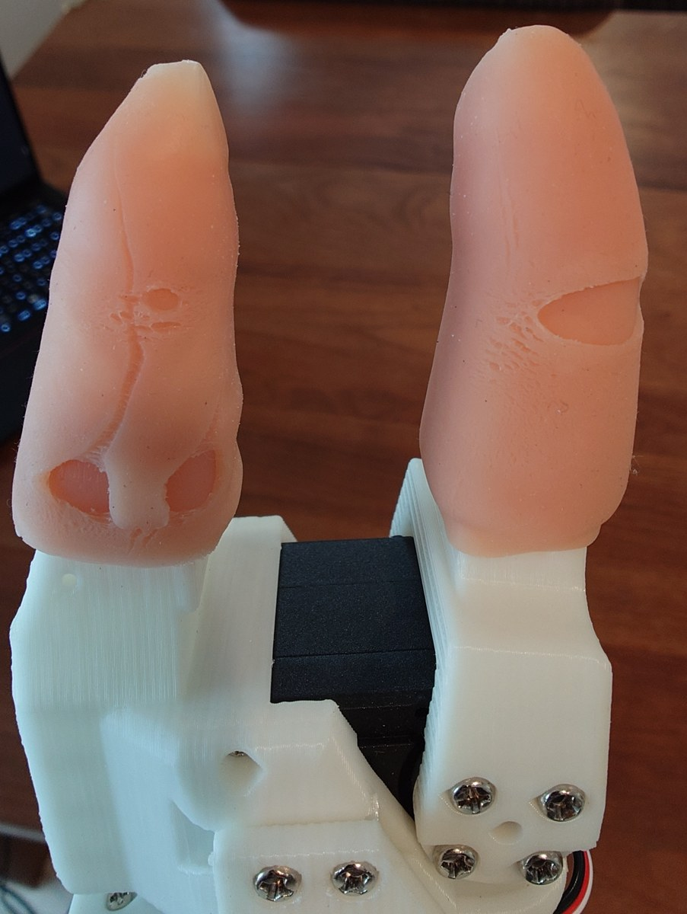
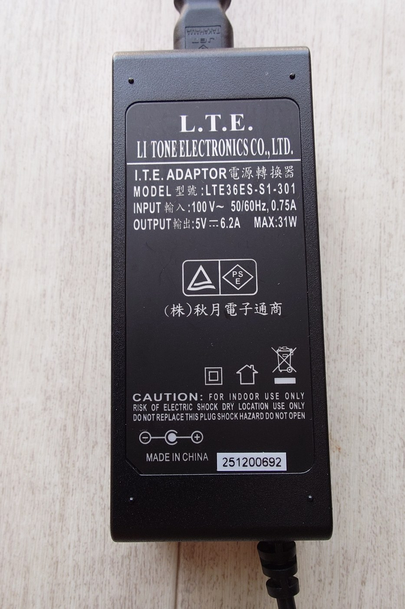
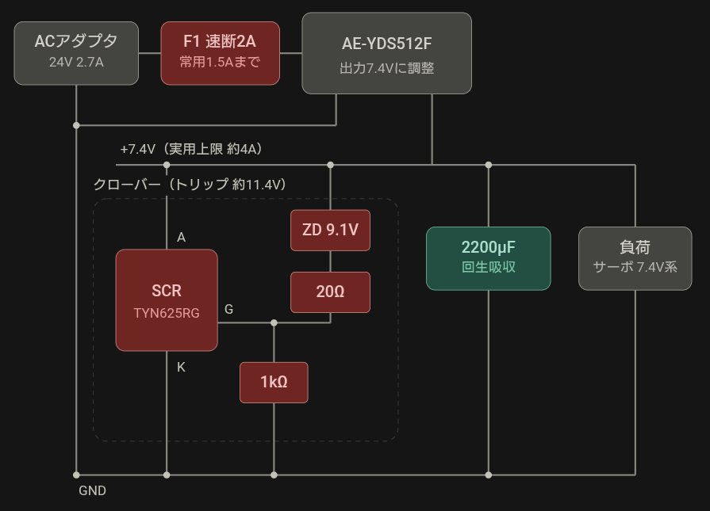
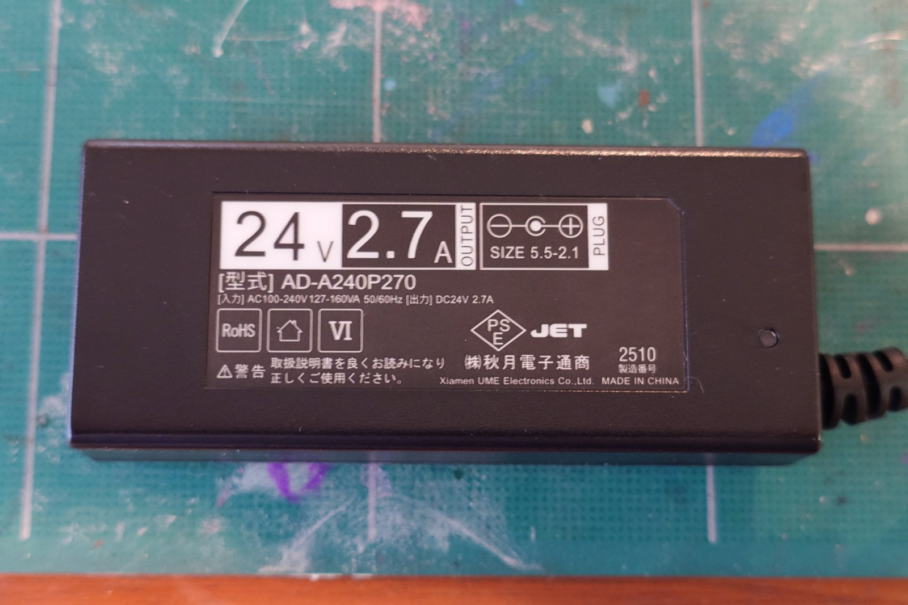

# ものごころ=MONOGOKORO, Thinks of Things, 物心 — details

[日本語](README_DETAILS.md) | **English** | [简体中文](README_DETAILS_CN.md)

← back to [README_EN.md](README_EN.md)

The long half of the README: the per-layer write-ups from "What this fork adds", the A/B latency work from "Measured, not assumed", and the body of every entry under "Known limitations".

## What this fork adds

### 1. Impedance control on a PREEMPT_RT isolated core

[`rust/so101_impedance_ctrl/`](rust/so101_impedance_ctrl/) is a standalone Rust daemon that
exclusively owns the follower's serial bus and runs

```
pwm = clamp(K · (target_pos − present_pos) + D · (target_vel − present_vel))
```

for **all six motors, the gripper included**, at **400 Hz** on a `SCHED_FIFO` thread pinned to an
`isolcpus`-isolated core. Python never touches the bus; it exchanges targets and telemetry through
a `#[repr(C)]` shared-memory segment guarded by a seqlock.

The gripper is deliberately not left in position mode. A rigid gripper is exactly the thing that
snaps the chip, so it runs the same K/D law as the arm with a much softer default K.

Open-loop PWM, because the STS3215 exposes no host-streamable torque register. Noisier than true
torque control, and an accepted trade-off rather than a hidden one.

Loop rate is bounded by the servo link, not the CPU: three bus transactions per tick at ~256 µs of
USB round trip each is ~0.8 ms against a 2.5 ms period. **The measured tick is longer**: 1.1-1.5 ms
mean over intervals with a healthy bus (2026-09-09, defaults; 1.1 ms with
`--current-read-divisor 4`), so about 1.5x the figure above, with the margin still intact.
Beyond 400 Hz there is nothing to gain --
what limits how the arm feels is open-loop PWM and gearbox friction, and 400 Hz is already far past
the arm's mechanical bandwidth.

### 2. Force feedback on the leader gripper

With `--leader-port`, the same loop also drives the **leader** arm's gripper as a haptic display, so
the operator feels what the follower is holding. The other five leader servos stay torque-off and
backdrivable.

The force is derived from the follower's own tracking error, not from a force sensor: a free gripper
reaches its target and the trigger stays slack; a blocked one lets the commanded position run ahead
of the achieved one, and that gap grows with how hard the operator is asking it to squeeze.

Both arms share **one loop on one core**. Their ports are separate, so the half-duplex constraint
does not couple them, and a single tick keeps the two arms' samples in lockstep -- two independent
loops would let their phase free-run, injecting a full period of variable delay into the coupling,
which is precisely what destabilises a bilateral loop.

### 3. ACT reasons about force and compliance

No changes to `modeling_act.py`. Both projections already derive their width from the feature
shapes, so widening the robot's declared features is sufficient.

|                           | stock SO-101     | this fork                                                                            |
| ------------------------- | ---------------- | ------------------------------------------------------------------------------------ |
| `observation.state`       | `pos` ×6 → **6** | (`pos` + `current_avg` + `pwm_cmd` + `ff_pwm`) ×6 + rail + cerebellum flags → **26** |
| `action` (per chunk step) | `pos` ×6 → **6** | `pos` ×6 + `K` ×6 + `D` ×6 → **18**                                                  |

**Input.** Each motor's `Present_Current` is sampled one servo per tick round-robin and averaged in
Rust over a fixed window (~0.5 s at the defaults). ACT reads the pre-averaged value at camera rate,
so it sees contact force without the per-tick noise. The supply rail travels alongside it, because a
current read without a concurrent rail reading cannot be told apart from a stiff mechanism.

The two duty columns are the loop's own account of itself: `ff_pwm` is the cerebellum's share and
`pwm_cmd` the total, so their difference is the feedback share -- the quantity the climbing fibre is
derived from. Recording both is what lets which frames were worth having (the ones the cerebellum could
not predict) be judged after the fact rather than having to be decided before the first episode. The
case temperature is deliberately absent; it belongs to whichever servo the health poll last read, so
recording it truthfully would mean recording that round-robin id as a column too.

**Output.** ACT's action chunking is unchanged -- it still predicts `chunk_size` steps ahead -- but
each step now carries a per-joint stiffness and damping alongside the position. The policy chooses
its own compliance over the horizon; K/D are clamped in Python and again in Rust before reaching a
servo.

### 4. A cerebellum, learned online on the integrated GPU

[`rust/so101_impedance_ctrl/src/cerebellum/`](rust/so101_impedance_ctrl/src/cerebellum/) predicts
the load the reflex would otherwise carry as a standing error:

```
pwm = K·(x_t − x) + D·(v_t − v) + ff(sensory state)
```

The structure is Marr-Albus-Ito, mapped onto the hardware directly:

| cerebellum       | here                                                                                          |
| ---------------- | --------------------------------------------------------------------------------------------- |
| mossy fibres     | 30 signals -- per joint: encoder phase as `sin`/`cos`, velocity, tracking error, current      |
| granule cells    | 16384 units, each reading 4 mossy fibres through a **fixed random**, never-learned projection |
| Golgi inhibition | one global threshold, on a feedback loop against measured sparsity (~2% left active)          |
| parallel fibres  | that sparse code, normalised, carrying a ~150 ms eligibility trace                            |
| Purkinje cells   | a linear readout, 6 outputs -- **the only learned layer**                                     |
| climbing fibres  | the reflex's own standing duty                                                                |

```
ΔW = rate · (cf · e  −  leak · W · e)
```

Three factors -- parallel-fibre eligibility, climbing fibre, and nothing else. The `leak` term is
what makes it a _modified_ Hebbian rule rather than a runaway: a bare Hebbian product only grows
once the error has a consistent sign, which is exactly what gravity produces. Both terms are gated
on a live climbing fibre: a `cf` of zero is the absence of an error signal, not an error of zero,
and a decay left running without one dismantles the very feedforward that made the error go away.

**No backpropagation, and none is needed.** Only one layer has adjustable synapses, and its error is
already expressed in the units its output is in (PWM), so the credit-assignment problem backprop
exists to solve never arises. What it costs instead is parameters rather than depth -- 16k granule
cells to get the separation a trained hidden layer would get with a few hundred, which is precisely
the trade an otherwise idle iGPU absorbs for nothing.

The teaching signal is a quantity the daemon already computes every tick: whatever duty the spring
is _still_ having to hold is, by definition, what the prediction failed to cancel. So learning is
online and unconditional -- no dataset, no training phase, no episode boundary. The arm learns while
it is teleoperated, while ACT drives it, and while it sits still; point `--cerebellum-weights` at a
file and what it learns accumulates across runs.

It never runs inside the control loop; see [Measured, not assumed](README_EN.md#measured-not-assumed) for the
two numbers that make that non-negotiable. The handoff is a seqlock in both directions, so a slow or
dead cerebellum cannot stall the reflex, and nothing is lost by the delay while the iGPU is not
carrying heavy work of its own -- the load being predicted is quasi-static
([Known limitations](#known-limitations)).

**Off by default**, and safe to switch on mid-hold: the weights start at zero, so an untrained
network contributes exactly nothing. Its output is clamped, slew-limited in both directions, and
zeroed by every fail-safe the reflex has. The gripper is excluded from it entirely -- a gripper that
learns its own grasp keeps squeezing after the object is gone. Full safety envelope and tuning:
[`rust/so101_impedance_ctrl/README.md`](rust/so101_impedance_ctrl/README.md#cerebellum-an-adaptive-feedforward-on-the-igpu).

### 5. A pontine relay, so the cerebellum can be told what it is holding

The mossy fibres above carry proprioception only, which means the cerebellum cannot tell two
payloads apart: 20 g and 200 g pass through the same joint angles on the way to the same place, and
the difference only shows up _after_ the load has pulled the arm down -- the one thing a
feedforward exists to prevent. [`rust/so101_impedance_ctrl/src/pontine.rs`](rust/so101_impedance_ctrl/src/pontine.rs)
adds two channels from the policy layer to the tail of that vector, taking it from 30 signals to 32.

It relays an **identity, not a mass**. The policy is never asked how heavy the object is. Biology
hands the cerebellum the object and keeps the weight-to-force map in the cerebellum -- grip force
is scaled correctly before lift-off, from a memory indexed by which object this is -- so asking a
policy for grams would move the cerebellum's job up a layer and demand a calibration nothing in
this loop can teach it.

And it **does not compute**. It is a first-order lag and nothing else, because the expansion into a
separable code is already paid for by 16384 granule cells on a fixed random projection. A trained
layer here would duplicate that, and would need its error routed back through the granule layer and
the readout to learn -- which is exactly the credit assignment this design does not have and does
not want. It is a sibling of the cerebellum in the source tree for the same reason it is one in the
brainstem.

**The channel has a source now, and it is still a constant.** `--robot.pontine_context` is the
operator's declaration of which of two indistinguishable situations is being demonstrated:
`send_action` clamps it to `[-1, 1]` and writes it to shared memory, and
`PontineContextProcessorStep` records it into the dataset as `context.<i>` action columns.
Recording it as an _action_ is the point: ACT has no context of its own -- its CVAE latent is
zeroed at inference by construction -- but a context inside the action it is trained to reproduce
is one it can learn to emit from the images, reproducing the recorded constant first exactly as the
`.k`/`.d` columns do. `--cerebellum-context` still pins the channel by hand, bypassing shared
memory and the lag both, which is what the bench wants. Two constants that came out of the CPU
reference rather than an arm, and are regression tests now: swing every channel to `+/-1` rather
than raising a `0/1` flag (one differing fibre recovers 64 of an 80-count separation, two recover
all 80, for the same cost), and interleave the contexts while learning rather than training one to
convergence and then the other (most granule cells draw no context fibre, so their weights are
shared, and blocked training leaves the first context reading 98 where it should read 40) --
`--robot.pontine_context_cycle` rotates them per kept episode so one recording run interleaves
on its own.

## The A/B latency work

The cerebellum step and the ACT forward pass are why the cerebellum has its own thread rather than a slot in the tick. That it
stays out of the way was then checked rather than assumed -- 3 × 20 s each way, alternating,
10800 control ticks per condition. (Against a stub serial port, so the absolute tick cost is
timeout-dominated and means nothing on its own; the _comparison_ is what is being made.)

| control loop           | mean tick | overruns   | worst tick |
| ---------------------- | --------- | ---------- | ---------- |
| cerebellum off         | 3219 µs   | 10 / 10800 | 7344 µs    |
| cerebellum on the iGPU | 3228 µs   | 9 / 10800  | 10971 µs   |

Mean cost and overrun rate are indistinguishable. The worst-case tick swings by milliseconds in
_both_ columns -- one repetition had the quiet run produce the worse outlier -- so that tail belongs
to the laptop, not to the cerebellum.

**Policy inference on the same iGPU was checked the same way** (2026-09-04: a dead bus on a pty, no
plasticity, no `SCHED_FIFO`, 25 s per condition, load from `examples/load_igpu_with_act.py`).

| condition                                                            | cerebellar step, mean |
| -------------------------------------------------------------------- | --------------------- |
| cerebellum alone                                                     | 588-646 us            |
| + ACT inference (once every 3.3 s -- the default `n_action_steps`)   | 504-605 us            |
| + ACT inference (back to back -- the temporal-ensembling worst case) | **311-427 us**        |

No condition dropped a single 200 Hz step (600-604 steps per 3 s), with zero errors and zero
rejections. **The cerebellum is faster under the heavier load.** A dispatch this size costs
submission latency rather than compute, and an idle iGPU has clocked down; a continuous load keeps
it awake. The contention this was measured to find is not there, and what is there points the other
way.

The tooling for re-deriving all of it ships too: `--probe-direction` measures drive direction with a
bounded, auto-aborting nudge; the checker's live table separates "too soft" from "driven the wrong
way", which look identical from across the room; and `cargo test --test cerebellum_gpu_tests --
--nocapture` reprints the latency table on whatever host you are on.

## Known limitations

The body of every entry listed under [Known limitations](README_EN.md#known-limitations). The README carries the names; the conditions and the history are here.

### The pontine context is unverified on hardware

**The pontine context is not verified on hardware, and nothing yet _infers_ it.** The channel is
wired end to end -- config to shared memory to mossy fibres, with the demonstration's context
recorded as an action column -- but its two constants were measured against the CPU reference
rather than an arm, and a policy reproduces whatever the operator labelled until it learns to
predict it from the images.

### The cerebellum droop numbers were retaken

**The cerebellum's droop numbers were retaken on 2026-09-08; the 2026-08-28 ones are withdrawn.**
The old session reported `shoulder_pan` 3.00 -> 0.00, `elbow_flex` 9.00 -> 0.00 and
`shoulder_lift` 12.57 -> 3.00 counts of droop at unchanged K. Do not rely on any of it.
`shoulder_pan`'s power stage had shorted, and writing to it pulled the shared rail from 4.6 V to
2.4 V for ~820 ms. This page previously claimed the _comparison_ survived because both sides ran
under the same fault. That was wrong: the fault began partway through the session, so which side
of it each run fell on decides the direction of the effect -- and the CSVs are gone.
**The retaken numbers** (rail mean 4.52 V, min 4.50 V; one pose file across all runs; K
unchanged; two stereo cameras carried on the wrist): droop of `shoulder_lift` 5.00 -> 1.02 and
`elbow_flex` 21.00 -> 1.00 counts. `err = pwm / K` is an **identity** when nothing
but a PD law is in the path: it agreed to the decimal for arithmetic reasons, not physical ones.
And sd 0.00 only says the arm is stationary, which **stiction produces as readily as balance**.
Four runs at identical settings put `shoulder_lift`'s holding duty at 100 / 180 / 200 / 255, every
one of them at sd 0.00. **A holding duty is not a value but a band.** Measured by approaching the
same target from above and from below, that band is 18.0 counts wide on `shoulder_lift`
(duty 120 vs 480) and 12.9 counts on `elbow_flex` (duty 300 vs 106) -- **the same order as the holding duty it
brackets**. 100/315 is not the band's value; it is the edge reached from above (`--approach-from`,
2026-09-09, rail 4.40-4.51 V, case 26-32 C, 25% RH). The ff readout still becomes path-dependent
with `--cerebellum-cf-deadband`. And the `--cerebellum-ff-max` clamp being reached on two joints
**was not inflated**: on a healthy rail `elbow_flex` still asks for 315 and still hits the 300
clamp. **A clamp that binds in normal operation cannot tell normal from abnormal**, so it needs
re-siting -- not yet done, because 315 is one edge of one pose's band and the legitimate maximum
across poses is unmeasured.

### The feedforward decayed instead of settling

**The feedforward decayed instead of settling. Fixed; the fix is unmeasured.** In both learning
runs it bled away with a time constant of minutes while the joint sat perfectly still, then
snapped back to the clamp once the arm finally slipped. The cause was the rule, not the arm: the
decay was gated on the eligibility trace but not on the climbing fibre, so the fixed point was
`w = cf / leak` -- weights that need a standing error to hold them up. The residual that leaves is
under a PWM count, narrower than the stick band, and inside that band the joint cannot move to
report the error at all. Both halves are now gated on a live climbing fibre, and
`--cerebellum-cf-deadband` (default 5.0) sets where the reflex counts as silent. **That default was measured on a
healthy arm on 2026-09-08 and is too low.** It was derived as "above the leak's residual, below one
encoder count times the joint stiffness" -- but position is quantised and the error never reaches
zero. `wrist_flex` (K=10) alternates between +/-2 counts, so its feedback duty never drops below
20 and never enters a band of 5; the ff hunted between 0 and 126 with a **69-second period**.
Raising it to 25 removes the oscillation entirely (0.2 counts over 173 s, and within 4% of the
true load) -- but the ff then freezes the moment the error enters the band, so **it stops being a
measurement of the load and becomes a function of how far the transient got**. The binary's default is
still 5. **The systemd unit starts it at 8 since 2026-09-17** -- the same "one count times joint
stiffness" derivation, now that the largest shipped K is shoulder_lift's 8. Whether 8 removes the
oscillation has not been measured. `0` restores the old behaviour. **The stick band is not an artefact of the
supply collapsing** -- separated on 2026-09-09: the band appears on a healthy rail (4.44-4.51 V
mean, 4.40 V min). Its width, and the fact that it is the same order as the
holding duty it brackets, are measured under
[The cerebellum droop numbers were retaken](#the-cerebellum-droop-numbers-were-retaken).

### The silicone fingertips split after two weeks

**Bare silicone finger cots tore after about two weeks of use** (found 2026-09-16). The splits are
on the gripping face -- two on the left cot, one larger one on the right.

**Stretched on tight, a cot tears gradually. Put it on a little loose.** That is from handling
them, not from an A/B on how tightly they are fitted.

<p align="center">
  
</p>

A **natural-rubber finger cot** with a dotted grip surface now goes over the top. Whether the rubber
lasts longer is not known yet: it went on 2026-09-16, and not enough time has passed to compare.

**Material lifetime was not an axis anything here was measured against.** The deadband, the
stiffness and the way contact comes back were all measured with these fingertips on, and the
fingertips become a different object in two weeks. One more reason a constant needs a date.

### Touch has no where and no slip

**Touch stops at how hard, not where or whether it is slipping.** A compliant fingertip turns grip
force into encoder counts, and that is the whole of the tactile sense here: one scalar per jaw,
available to the reflex at 400 Hz. Where on the finger contact happened, and the micro-vibration
that says an object has _begun_ to slip, both need a purpose-built sensor rather than a commodity
part -- and what this repository is trying to show is how much of the stack can be built without
one. The wrist camera can see that something has slipped, at ~30 Hz; it cannot see it starting.

### The mossy fibres bound what can be learned

**What it can learn is bounded by its mossy fibres.** They carry pose, velocity, tracking error
and current, so it can learn gravity, joint friction and a fixed payload -- but nothing tells it
which of two payloads is in the gripper, so it cannot tell them apart. Camera features are the
obvious missing bundle.

### Demonstrations do not label the layers below

**Demonstrations do not label the layers below the policy.** A torque-off leader is a position
sensor and nothing else, so episodes are labelled with the config's default K/D and ACT trained on
them learns to reproduce those gains, not to vary them. The cerebellum's weights likewise persist
to a file and not into any dataset. The leader gripper's force feedback is the first step toward
fixing the first half; deriving stiffness from cross-demonstration variance is the likely next.

### The bundled supply collapses at the defaults

**On the bundled 5 V 4 A adapter the rail collapses at this fork's defaults.** The rate and the
conditions are under [A better supply did not remove every collapse](#a-better-supply-did-not-remove-every-collapse),
and how it was separated is under [The comms errors were the supply](#the-comms-errors-were-the-supply).
What belongs here is only what is worth knowing before the symptom shows up.

- **It is not that the arm will not run.** It runs, and collapses intermittently.
- **The symptom never mentions voltage.** While the rail is down the servos' replies are
  disturbed and the host sees a read timeout. From the duty columns alone that is
  indistinguishable from "K is too soft" -- which is how it was read here.
- **Whether upstream position control does the same has not been measured.** A stock
  `so101_follower` writes `Goal_Position` and lets the servo's own PID drive, but the current it
  takes to lift against gravity is required either way. **"It was never seen before" is not
  evidence**: the error byte was discarded for three weeks, so upstream collapsing unobserved is
  not ruled out.

**What to do, and what it buys. Two routes, and only one of them has been measured here.**

_Measured._ A bigger 5 V supply: **regulated 5 V, 6 A or more, 5.5x2.1 mm centre-positive** -- the
plug the arm already uses, so it is a straight swap. Judge a candidate on its quoted _load
regulation_ rather than its maximum current ("4 A" is a ceiling, not a promise about what the
voltage does on the way there); a label will not tell you, so this comes off a datasheet or a
product page. What the swap bought is under
[A better supply did not remove every collapse](#a-better-supply-did-not-remove-every-collapse).

_Measured here, 2026-09-16._ Run the servos at the voltage they were designed for. The STS3215 is
a **7.4 V** servo that the standard build runs at 5 V: vendors list it as **6-7.4 V**, and its
rated torque is quoted at 6 V and 7.4 V, never at 5 V. Running at the bottom of the range costs
torque, and lost torque is paid for in current -- which is what drags the rail down in the first
place. The servos' own `Max_Voltage_Limit` reads 80 (8.0 V) on this arm, so 7.4 V is inside what
they will accept. How it was built and what it measured is under
[A 7.4 V supply, built](#a-74-v-supply-built); the short version is that **the servos read
7.0-7.1 V** (the wiring drops the rest) and the distance to `Min_Voltage_Limit` 40 (4.0 V) went
from **0.9 V to 3.0 V**. **The prediction about the binding constraint got the direction right and
the destination wrong**: this section said to expect `Max_Temperature_Limit` (70 C) to become the
limit, and what the servos actually raised that day was **`0x20`, overload by the unconfirmed
mapping** -- with the case no higher than 33 C. The voltage bit `0x01` appeared once, on all six motors, at the moment the power was switched off. It also
travels better than a part number, because a DC-DC module takes any input while the brick below is
100 V only.

<p align="center">
  
</p>

The one measured here, for the record: **`LTE36ES-S1-301`** (Li Tone Electronics), 5 V 6.2 A, 31 W,
sold by Akizuki as catalogue number 111105 for about 2,300 yen. **Japan only, and not merely on
availability -- its input is 100 V.**

### The comms errors were the supply

**The "comms errors" seen while driving are the supply.** Separated on 2026-09-10. Every Feetech
status packet carries the servo's own error byte and the daemon was discarding it. Once read,
**all six motors raise the voltage bit (bit0) in the same tick, for the same 833 ms** -- not one
servo protecting itself, but the shared rail collapsing. `Min_Voltage_Limit` is the factory 40
(4.0 V) on every motor and idle `Present_Voltage` is 46 (4.6 V), so **the margin is 0.6 V**. The
bundled 5V4A adapter drops from 4.97 V to 4.59 V with nothing but the servos connected (measured
at the adapter terminals with a meter). A burst past `--max-blind-ticks` zeroes the duty and the
arm falls, which in the duty columns is indistinguishable from a gain that is merely too soft --
and was read as exactly that for weeks. **`supply_decivolts` is sampled round-robin once a
second, so an 833 ms dip cannot appear in it. The servos are the fastest voltmeter on this
machine.** They now surface as the `servo_error` column and `FAULT_SERVO_ERROR`.
**Software cannot rescue this** (measured the same day against the defaults `--pwm-max 1000` /
`--ramp 5`): `--pwm-max 700` makes it **26x worse** and `--ramp 15` **18x worse**. Both push the
command below the force a lift actually needs, so the arm never reaches the target, pins itself
against the clamp, and turns a short large current into a long moderate one.
`--serial-timeout-ms 2` is **worse** too (2 ms cuts replies that were going to arrive, and a late
reply is read as the answer to the next question). **Every number measured here sits on top of
this.** See [The bundled supply collapses at the defaults](#the-bundled-supply-collapses-at-the-defaults) for what to power it with.

### A better supply did not remove every collapse

**A better supply removed the collapse at the defaults, and not everywhere.** Swapped to an
`LTE36ES-S1-301` (5 V 6.2 A, 31 W) on 2026-09-14: idle 4.9 V, so **0.9 V of margin**, 4.8 V while
holding against gravity, 4.50 V at worst while a hand pushed the arm around. **Its terminals read
5.18 V unloaded** (meter, measured 2026-09-18) -- the figure that sits beside the bundled adapter's
4.97 V under the same condition. Counted off the
400 Hz error byte, same pose and same gains: at the defaults, **one 833 ms collapse in 329 s
became nothing at all over 5 ms in 233 s**; at `--pwm-max 700`, **8 episodes over 100 ms became
1**, of 390 ms. **Each condition is one run and the two adapters were not alternated**, so the
direction is established and the size is an estimate. (The bundled adapter was measured
**second**, though, so any drift favoured it, and it lost anyway.)

### The single-tick bit0 survived the 5 V swap and went at 7.4 V

**The single-tick population is not the rail, and the 5 V swap did not remove it.** One servo
raising bit0 for exactly one 400 Hz tick happens on motor 6 at roughly 0.17/s **with the arm
limp, no duty commanded, a 27 C case and 0.9 V of headroom** -- a state with nothing to over-heat
or over-load. So **"a bit on one motor alone is not the supply, it is heat or load" is withdrawn
(2026-09-14)**. Either a servo sees a dip the shared reading cannot, or bit0 is not voltage: the
bit-to-name mapping is from secondary sources and has never been checked against a protocol
document. Both are open. **It is not independent of the supply, though.** At rest and limp, at
matched case temperature: **0.688/s on the bundled adapter (4.6 V) against 0.200/s on the
regulated one (4.9 V)**, with motor 5 appearing only on the bundled one. Temperature was measured
out rather than assumed out -- the regulated adapter gave 0.165/s at its coldest and 0.200/s warm,
so heat moves this by 0.035 and the supply by 0.49. Whatever bit 0 reports, the rail's standing
level sets how often it fires.

**On 2026-09-17 the same procedure, once, at 7.4 V, gave none.** The daemon alone (no client,
no duty commanded), the arm folded and limp, **603 s (about 240k ticks)**, `Present_Voltage`
70-72, case 29-33 C. At the 5 V 6 A rate of 0.165-0.200/s that would have been 100-120 events.
Zero puts the rate below 0.005/s at 95% (3/603) -- **at least 33x fewer than on 5 V 6 A.** The
cases were warmer than the coldest 5 V run (27 C), and warmth only pushed the rate up there, so
temperature does not explain it. **This is the limp arm; single ticks under drive are not
measured.** (One malformed packet from motor 5 right after start was the only comms error.)
**One condition differs: this run was not realtime, and both 5 V runs were `SCHED_FIFO`** (a
rebuild had dropped the setcap). An earlier measurement found single ticks at 0.21/s with and
without realtime alike, so it is unlikely to explain the zero, but it was not matched.

**The 2026-09-16 "none in 78 minutes" had the wrong window.** Power was cut at 04:29:02 and
nothing crossed the bus after that, so no single tick could have shown. The observable span is
03:16:53-04:29:02, **4329 s**, which makes roughly 710-870 expected (this section said "roughly
800", then "780-950 over 4735 s"). Driving, holding and limp are mixed in it with the proportion
unrecorded, so it only supports the run above.

### A 7.4 V supply, built

**2026-09-16: a supply that makes 7.4 V from a 24 V brick.** This is what turned the paragraph
above from a datasheet argument into a measurement.

**7.4 V looks like an odd number because it was not chosen as a voltage.** The datasheet says
**`2S, 7.4V`** -- the nominal voltage of two lithium cells in series (3.7 V x 2). Read that way the
whole ladder lines up: **8.4 V** fully charged (4.2 V x 2), **7.4 V** nominal, **6.0 V** near the
discharge floor. **The vendor's "6-7.4 V" is not a recommended range of voltages, it is the usable
range of a 2S pack.** Which puts 5 V not at the bottom of the range but outside it. (It also
explains the factory `Max_Voltage_Limit` of 80 -- 8.0 V, below a full pack's 8.4 V. That is a
setting, writable, not the hardware's limit.)

**Said up front: this route needs a soldering iron.** The goal here is layers below the policy
built from hardware anyone can buy, and every part below is mail-order -- but the assembly is
yours. **Running the arm does not need it**: the other option above, swapping in an off-the-shelf
5 V 6 A brick, is a plug change and is measured too. 7.4 V is the one you take _after_ that, and
it trades an hour at the bench for margin going from 0.9 V to 3.0 V.

<p align="center">
  
</p>

The labels are in Japanese: 24 V 2.7 A adapter -> F1 2 A fast-blow (1.5 A continuous) -> buck
trimmed to 7.4 V -> +7.4 V rail (about 4 A usable) feeding the crowbar, a 2200 uF / 35 V capacitor
(absorbs regenerated energy) and the servos. The crowbar's "trip about 11.4 V" is **the
datasheet-`max` calculation**; the measured figure is below (`> 10.24 V`). **The line joining input
and output ground (bottom left) is not decoration** -- it was missing on
[the build day](#what-the-build-day-cost).

<p align="center">
  
</p>
<p align="center">
  
</p>

**The 24 V input is not a choice.** `AE-YDS512F` will not start below 18 V, so 12 V is out. It puts
out 3.3-12.5 V adjustable at 5 A (6 A peak) and carries its own overcurrent protection.

**What the crowbar is for.** Going to 7.4 V settles the undervoltage problem and raises a new one
on the other side: if the buck stage fails short, 24 V arrives at the servos. The crowbar watches
for exactly that. A servo's own `Max_Voltage_Limit` of 80 (8.0 V) is **where it protects itself,
not where it breaks**, so the band between 8.0 V and the trip point can be left to the servo.

**The trip point is measured: `> 10.24 V`** (2026-09-16, no load, input steady at 24.5 V). It held
at 10.24 V and fired just above. **The upper side is not measured** -- once it fires, the buck
module's overcurrent protection hiccups and the rail oscillates, so only the value it falls to can
be read. One-sided, but it gives the distance that matters:

|                                            | volts       |
| ------------------------------------------ | ----------- |
| servo self-protection, `Max_Voltage_Limit` | 8.0 V       |
| operating point                            | 7.4 V       |
| crowbar (measured)                         | `> 10.24 V` |

From the datasheets the same point computes to 10.2 V at `typ` (`IGT` 15 mA / `VGT` 0.8 V) and
11.4 V at `max` (40 mA / 1.3 V). **The measurement sits essentially on the typ figure and nowhere
near max.**

**And it was actually fired.** Confirming that a protection circuit does not misfire does not
distinguish it from one miswired so it can never fire at all. **A protection circuit that has never
operated is not a protection circuit.**

#### What the build day cost

**With input and output grounds unjoined, the DC-DC hiccups at about 1 Hz.** The output comes up
slowly, something ticks, and the voltage wobbles. The tick is not the SCR -- **a thyristor latches
silently** -- it is the inductor or a ceramic on the DC-DC, at the period of its protection retry.

**Both measurements that split it used no instrument beyond a meter and a finger.**

- **Read the input** -- steady at 24.5 V, which ruled out the supply side (brick, UVLO oscillation)
  and left the output-side protection. Thirty seconds with a multimeter.
- **Touch the SCR** -- cold. A conducting SCR carries the short and gets hot. **That killed the
  "zener in backwards" hypothesis outright**, which had a whole wiring argument built on top of it.

**The mechanism is not resolved.** Ground was the cause (joining it silenced the tick), but whether
the current-sense reference moved and the protection misfired, or the feedback return floated and
the module drove duty up until the protection fired **correctly**, is not separated. **The next
move is the same either way**, so it was left open.

#### First numbers off the arm at 7.4 V

|                                       |                          |
| ------------------------------------- | ------------------------ |
| `Present_Voltage`, six motors at rest | **70-71** (7.0-7.1 V)    |
| distance to `Min_Voltage_Limit`       | **3.0 V** (0.9 V at 5 V) |
| case temperature                      | 24-33 C (limit 70)       |
| `servo_error` over a 120 s hold       | **none**                 |

**The 7.0-7.1 V the servos read is 0.3-0.4 V below the 7.4 V at the supply output.** Wiring and
connector drop is the obvious reading and it is **not measured** -- metering the output terminals
with the servos connected would place it (not done). **This used to add "at 5 V the brick terminals read 4.59 V and the
servos read 4.6 V, so on the same wiring that drop has no explanation". Withdrawn 2026-09-18**,
for three reasons:

- **Nothing records 4.59 and 4.6 being read at the same moment.** 4.59 was a meter on the brick
  terminals, 4.6 was an idle `Present_Voltage`. Two separate measurements were set side by side
  and read as "almost no drop"
- **4.59 belongs to the bundled adapter, which was replaced** on 2026-09-14 by a 6.2 A one
- **The figure for that replacement is further up this page**: 4.9 V idle. The withdrawn sentence
  reached past a newer number in the same document to fetch the older one

**What can be said is a bound.** The 5 V 6.2 A adapter reads **5.18 V at its terminals unloaded**
and the servos read **4.9 V idle with everything connected**. The conditions differ, so the two do
not subtract: 0.28 V mixes the wiring drop with the adapter's own droop under load. But loading a
supply never raises its terminal voltage, so **the wiring and connectors drop at most 0.28 V**
(`terminals under load - 4.9 <= 5.18 - 4.9`).

**This does not explain the 0.3-0.4 V at 7.4 V.** Different rail, different current, not directly
comparable. Comparing them needs the terminals and the servo side read at the same moment **with
the servos connected** -- one meter touch, not done.

**No `servo_error` over a static hold is not evidence that collapses are gone.** Collapses appear
at high current and this condition draws little. The same day, oscillating the arm raised `0x20` on
two motors for 1.9 s -- **not the voltage bit `0x01`**.

### Interactive calibration is not implemented

**Interactive calibration and `setup-motors`** are not implemented for the impedance robot. Run
both with the stock `so101_follower` against the same servos, then copy the calibration across --
the two robot types write to different directories.

### An iGPU training OOM takes the desktop down

**Training on an integrated GPU can take the desktop down, and a cgroup does not prevent it.**
GPU memory and system memory are one pool, so a training OOM sends the kernel's OOM killer after
the compositor and `dbus-daemon`. `systemd-run -p MemoryMax=` does not bound device allocations --
measured 2026-09-11, 2 GiB on the XPU moved the scope's `memory.current` by 0.00 GiB -- so a
wrapped run reaches the OOM killer exactly as an unwrapped one. It did that day, and took an
editor with it. What works is `torch.xpu.set_per_process_memory_fraction`; see
[`SETUP_XPU.md`](SETUP_XPU.md).
